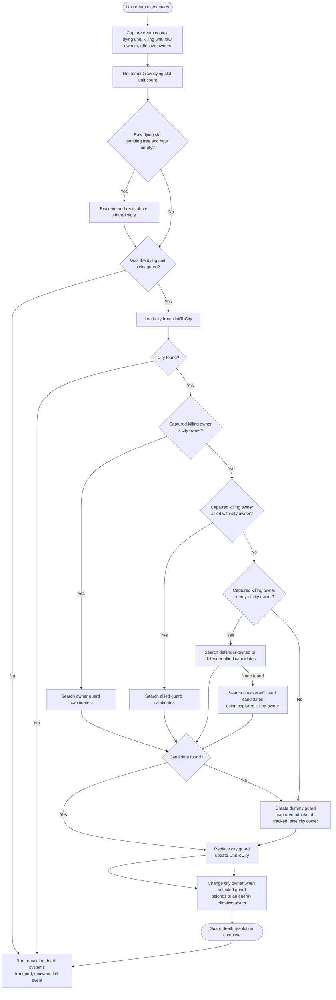

# ADR 0001: Guard death resolution uses death context

## Status

Accepted

## Context

City guard replacement depends on both unit death ordering and shared-slot owner
resolution. During a unit death event, `SharedSlotManager` decrements the raw
owner slot's unit count and may redistribute freed shared slots. That mutation
can remove the mapping from a raw shared slot to its effective owner before guard
death handling asks who owned the killing unit.

When guard death handling resolves owners after redistribution, a freed shared
slot can look like an empty raw player slot. That makes allegiance searches fail
and can assign a dummy guard or city owner to an uncontrollable slot.

## Decision

Unit death handling must capture a death context before shared-slot count
updates or redistribution run.

Guard death resolution must consume that death context for the killing unit's
effective owner. It must not depend on re-resolving the killing unit owner after
shared-slot redistribution.

Owner resolution code should expose whether an owner is a tracked match player,
so callers do not need to infer validity by poking at unrelated maps.

## Activity Overview

The important invariant is that every guard-death decision uses the captured
killing owner from the death context. It must not re-resolve the killer after
shared-slot redistribution.

## Consequences

- Guard death rules have a stable view of the killing unit's owner even if its
  raw shared slot is freed during the same death event.
- Tests can cover the exact "freed shared slot during guard death" case without
  simulating every Warcraft III event.
- Shared-slot ownership validity checks move behind an explicit module seam.
- Future guard replacement changes should update the death context and guard
  death resolution tests rather than adding local owner fallbacks in handlers.
