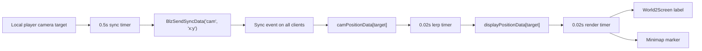

# Camera Position Overlay

## Motivation

The camera position overlay lets a viewer see where other players are looking.
It renders a floating player-name label over the world at each tracked camera
target and a small rectangular marker on the minimap. In Risk Next Gen this is
used by observers and by allied players in supported team modes.

The important design idea is that camera positions are treated as lightweight,
client-local presentation data. The game does not move units, change ownership,
or make gameplay decisions from the overlay. Players publish their current
camera target over sync data at a low rate, each client smooths the received
positions locally, and the local viewer's camera projects those world positions
into UI coordinates every render tick.

W3Champions builds intentionally disable this feature. The overlay depends on
`BlzSendSyncData` and per-player sync event registration, both of which are kept
out of W3C builds through `src/app/utils/sync-data-policy.ts` while replay
desync issues are being isolated.

## Current Behavior

The system is owned by `PlayerCameraPositionManager`. It is initialized from
`src/main.ts` after the console UI and initial fog/minimap setup are ready.
The feature is gated by `SHOW_PLAYER_CAMERA_POSITIONS`.

There are two user-facing modes:

- Observers and developer mode users get a telescope toggle in the top-left UI.
  The observer overlay starts off and is activated through that telescope
  control.
- Active players use the F9 "Ally Cameras" preference button. The setting is
  stored in `risk/camPan.pld` and controls whether allied camera positions are
  visible.

Visibility is resolved per local viewer:

- A viewer never sees their own camera marker.
- Observers and developer mode users can see every tracked player when their
  observer overlay toggle is on.
- Active players can see allied players when their local `cameraPan` preference
  is on.
- Non-observer active-player viewing is currently limited to lobby-team
  Promode, Chaos Promode, and Equalized Promode when there are more than two
  active players.
- Overlay rendering is enabled during `preMatch` and `inProgress`. Other match
  states hide all camera frames.

The overlay has two visual surfaces per tracked player:

- A world-space name label projected into screen coordinates.
- A minimap marker positioned by mapping the same world coordinates into the
  custom minimap coordinate space.

## Architecture

The implementation has four independent responsibilities.

1. Publish local camera target positions.
2. Receive and store each player's latest target position.
3. Smooth target positions into display positions.
4. Render local UI frames from the smoothed display positions.

The separation matters. Network sync can run slowly, render positioning can run
quickly, and overlay visibility can be toggled without stopping data sync.
Because sync continues while the overlay is hidden, turning the overlay on shows
fresh positions immediately.



## Data Model

`PlayerCameraPositionManager` stores three per-player maps:

```ts
type CamPositionData = {
    x: number;
    y: number;
};
```

- `camPositionData`: latest received network position. This is the target.
- `displayPositionData`: locally smoothed world position. This is what gets
  rendered.
- `frames`: the player's label box, label text frame, and minimap icon frame.

Two cache maps reduce repeated UI work:

- `minimapIconTextures`: last texture applied to each player's minimap marker.
- `frameTexts`: last label text applied to each player's name frame.

When a player leaves or is no longer active, `removePlayerFrame()` hides their
frames and clears all related data. Normal visibility changes call
`hidePlayerFrames()` instead, which only hides existing frames so they can be
shown again without reallocation.

## Network Sync

Every 0.5 seconds, each user-controlled local client samples its camera target:

```ts
const x = GetCameraTargetPositionX();
const y = GetCameraTargetPositionY();
BlzSendSyncData('cam', `${x}:${y}`);
```

The sync trigger is registered for every player slot:

```ts
BlzTriggerRegisterPlayerSyncEvent(syncTrigger, player, 'cam', false);
```

When sync data arrives, all clients parse the sender and payload:

```ts
const p = GetTriggerPlayer();
const parts = BlzGetTriggerSyncData().split(':');
const x = S2R(parts[0]);
const y = S2R(parts[1]);
```

On the first sync from a player, the manager creates that player's UI frames and
initializes both the target position and the display position to the received
value. On later syncs it only updates `camPositionData`.

In W3C builds this whole path is skipped: no camera sync trigger is registered,
no sync timer is started, and the F9 ally camera preference is shown as
unavailable.

Porting notes:

- Send the camera target, not the camera eye. The target is the map point the
  player is looking at and is the correct anchor for a label.
- The data is low priority and loss tolerant. A game with unreliable datagrams
  can send this over an unreliable channel because the next update replaces the
  previous one.
- Do not couple network publication to overlay visibility. Visibility is a
  local preference; the data stream should remain warm.
- Treat received camera data as presentation-only. Do not use it as authority
  for gameplay.

## Smoothing

The overlay receives positions only twice per second, but renders at roughly
50Hz. To avoid visible jumps, it runs a separate interpolation loop every
0.02 seconds:

```ts
const LERP_SPEED = 0.08;

display.x += (target.x - display.x) * LERP_SPEED;
display.y += (target.y - display.y) * LERP_SPEED;
```

If the squared distance between display and target is less than `1.0`, the
display position snaps to the target. This prevents long tails where the label
never quite reaches the exact target.

This is exponential smoothing rather than fixed-speed movement. At 50 ticks per
second with `LERP_SPEED = 0.08`, the displayed position closes about 8 percent
of the remaining distance each tick. That is enough to hide 0.5-second network
steps while still feeling responsive when a player pans quickly.

In another engine, keep the same shape but make it frame-rate independent:

```ts
const smoothing = 1 - Math.exp(-dt / smoothingTime);
display = lerp(display, target, smoothing);
```

Choose `smoothingTime` around `0.18` to `0.25` seconds for a similar feel.

## World Label Rendering

The render loop runs every 0.02 seconds. It first resolves whether the local
viewer is eligible, whether their overlay preference is enabled, and whether the
current match state allows camera overlays. If any check fails, all camera
frames are hidden and no positions are projected.

For each visible target:

1. Check whether the local viewer is allowed to see that target.
2. Refresh the cached label text if the name or relationship color changed.
3. Project the smoothed world position into local screen coordinates with
   `World2Screen(display.x, display.y, 0)`.
4. If the point is on screen and above the bottom UI cutoff, place the label.
5. Otherwise hide only the world label.
6. Update the minimap marker separately.

The current world label anchor is:

```ts
BlzFrameSetAbsPoint(frame.text, FRAMEPOINT_BOTTOM, sx, sy + 0.025);
```

The `0.025` Y offset lifts the label above the camera target. The steady-state
bottom cutoff is `sy >= 0.14`, which keeps labels out of the bottom console and
minimap area. The first-sync immediate placement path uses `sy >= 0.12`, then
the render loop applies the stricter cutoff on subsequent ticks.

The label frame uses a tooltip-style box:

- `TasToolTipBox` is parented to `ConsoleUIBackdrop`.
- `TasTooltipText` is parented to the box.
- The frame create context is `GetPlayerId(player) + 1`, which avoids context
  `0` used by `TooltipManager`.
- The box is anchored around the text with `0.01` padding on both corners.
- The text frame is disabled so it does not intercept mouse input.
- The text width is based on visible characters, with Warcraft color tags
  stripped from the length calculation.

Current width formula:

```ts
width = Math.max(0.02, visibleCharacterCount * 0.005 + 0.01);
height = 0.0058;
```

## World-to-Screen Projection

`src/lua/World2Screen.lua` is a local-camera projection helper. It converts a
world point into Warcraft III UI coordinates for the current client.

The helper caches camera parameters and invalidates them every `0.02` seconds:

- camera eye position
- angle of attack
- rotation
- field of view
- derived sine/cosine terms
- vertical screen-center shift
- field-of-view scale factor

For a world point `(x, y, z)`, it computes the vector from the local camera eye:

```lua
dx = x - eyeX
dy = y - eyeY
dz = z - eyeZ
```

Then it projects through the local camera basis:

```lua
xPrime = scaleFactor * (
    -cosAttackCosRot * dx
    -cosAttackSinRot * dy
    -sinAttack * dz
)

xs = 0.4 + (cosRot * dy - sinRot * dx) / xPrime

ys = 0.42625
    - yCenterScreenShift
    + (sinAttackCosRot * dx + sinAttackSinRot * dy - cosAttack * dz) / xPrime
```

It returns `(xs, ys, onScreen)`. The point is considered visible when:

```lua
xPrime < 0
and xs > -0.1333
and xs < 0.9333
and ys > 0
and ys < 0.6
```

The X bounds intentionally extend beyond the classic `0.0..0.8` UI range to
support widescreen. The Y range stays in the standard `0.0..0.6` Warcraft UI
height.

Porting notes:

- Use the viewer's local camera for projection, not the tracked player's camera.
- Use the tracked player's camera target as the world point.
- This implementation projects the target at `z = 0`. In a game with important
  terrain height differences, sample terrain height at the target and add a
  small vertical label offset in world space or screen space.
- Return both screen coordinates and an on-screen/depth flag.
- Keep projection local. The projected screen position is different for each
  viewer because every viewer can pan, zoom, rotate, or tilt independently.

## Minimap Marker Rendering

Each tracked player gets a semi-transparent minimap marker:

- frame type: `BACKDROP`
- parent: `ORIGIN_FRAME_MINIMAP`
- size: `0.009 x 0.006`
- frame level: `20`
- alpha: `200`
- shape: rectangular, roughly screen-like

The marker uses the same smoothed world position as the world label. It remains
visible as long as the overlay is visible and the viewer may see that target,
even if the world label is off screen.

Marker position is delegated to `MinimapIconManager.updateIconPosition()`:

```ts
normalizedX = (worldX - worldMinX) / worldWidth;
normalizedY = (worldY - worldMinY) / worldHeight;

uiLeftEdgeX = 0.4 - (0.8 * hudScale) / 2.0;
iconX = uiLeftEdgeX + 0.009 * hudScale + normalizedX * 0.14 * hudScale;
iconY = 0.004 * hudScale + normalizedY * 0.14 * hudScale;

BlzFrameSetAbsPoint(iconFrame, FRAMEPOINT_CENTER, iconX, iconY);
```

`hudScale` is measured by polling `ConsoleUIBackdrop` width every `0.1` seconds:

```ts
hudScale = BlzFrameGetWidth(consoleUI) / 0.8;
```

This is needed because Warcraft III Reforged lets players shrink the native HUD.
The minimap shrinks toward the horizontal center of the screen, so the custom
absolute-positioned markers must be scaled and shifted to stay pinned to it.

In another engine, this part is simply a world-bounds normalization:

```ts
u = (worldX - mapMinX) / (mapMaxX - mapMinX);
v = (worldY - mapMinY) / (mapMaxY - mapMinY);
marker.x = minimapRect.x + u * minimapRect.width;
marker.y = minimapRect.y + v * minimapRect.height;
```

## Color and Naming

World label text uses `NameManager.getDisplayName(player)` by default. If ally
color filter mode supplies a relationship color, the manager strips existing
color tags from the display name and wraps the visible name in the local
relationship color:

```ts
return `${allyFilterHex}${ColorStringUtil.stripColorTags(name)}|r`;
```

Minimap marker textures are resolved from the local viewer's perspective:

- Ally color mode `0`: use `NameManager.getOriginalColor(player)`.
- Ally color mode greater than `0`: use
  `AllyColorState.getMinimapColor(target, localPlayer, isColorBlind)`.
- Invalid color handles fall back to neutral gray
  `ReplaceableTextures\\TeamColor\\TeamColor90.blp`.

The selected color is converted to a Warcraft team-color texture path:

```ts
ReplaceableTextures\\TeamColor\\TeamColorXX.blp
```

The result is cached per player so the texture is only set when it changes.

For other games, preserve the same principle: colors are local presentation
state. A target can appear as an ally color for one viewer and an enemy or
observer color for another viewer.

## Observer Toggle

`ObserverCameraPositionOverlay` owns observer/developer overlay visibility.
It creates a top-left telescope control with two frames:

- a visible `BACKDROP` icon
- an invisible `GLUETEXTBUTTON` hit target using `ScriptDialogButton`

Both are positioned at:

```ts
FRAMEPOINT_TOPLEFT relative to ORIGIN_FRAME_GAME_UI
x = 0.138
y = -0.025
size = 0.02 x 0.02
```

The overlay starts hidden:

```ts
private overlayVisible: boolean = false;
```

When toggled on, the icon changes to
`ReplaceableTextures\\CommandButtons\\BTNTelescope.blp`. When toggled off, it
uses `ReplaceableTextures\\CommandButtonsDisabled\\DISBTNTelescope.blp`.

Observers cannot reliably click normal button frames in this map, so the helper
`CreateObserverButton()` polls child frame `5` of the button every second and
treats hover visibility as an activation signal. After a toggle, the button is
disabled and re-enabled to release focus.

Porting notes:

- In a normal UI framework, use a real click event.
- Keep observer overlay state local to the viewer.
- Notify the render manager when visibility changes so it can hide existing
  frames immediately.
- If porting inside Warcraft III, follow `docs/observer-ui-safety.md`; extra
  child frames or tooltips on observer-polled controls have caused desync risk.

## Lifecycle

Startup:

1. `src/main.ts` loads the frame TOC and initializes core managers.
2. `SetConsoleUI()` prepares the custom UI.
3. `PlayerCameraPositionManager.getInstance()` starts sync, lerp, and render
   timers if `SHOW_PLAYER_CAMERA_POSITIONS` is enabled and sync data is allowed
   for the current build.
4. `ObserverCameraPositionOverlay.getInstance()` creates the observer toggle.
5. `EVENT_ON_PRE_MATCH` refreshes observer-toggle eligibility.

Runtime:

1. Local clients publish camera target positions every `0.5` seconds.
2. All clients receive sync data and update target positions.
3. All clients smooth display positions every `0.02` seconds.
4. Each client renders only the frames allowed for its local viewer every
   `0.02` seconds.

Cleanup:

- When a player leaves, `EVENT_ON_PLAYER_LEFT` removes that player's frames.
- During sync cleanup, inactive players have frames and data removed.
- When the local overlay becomes invisible, all frames are hidden but kept for
  reuse.

## Implementation Template for Other Games

Use this as the minimal portable model:

```ts
type CameraOverlayState = {
    target: Vec2;
    display: Vec2;
    hasInitializedDisplay: boolean;
    label: LabelHandle;
    minimapMarker: MarkerHandle;
};

const tracked = new Map<PlayerId, CameraOverlayState>();

function publishLocalCamera() {
    const target = localCamera.targetWorldPosition;
    network.sendUnreliable("camera-target", {
        playerId: localPlayer.id,
        x: target.x,
        y: target.y,
    });
}

function onCameraTargetMessage(message) {
    const state = getOrCreateOverlayState(message.playerId);
    state.target = { x: message.x, y: message.y };

    if (!state.hasInitializedDisplay) {
        state.display = state.target;
        state.hasInitializedDisplay = true;
    }
}

function updateCameraOverlay(dt: number) {
    for (const [playerId, state] of tracked) {
        state.display = smoothToward(state.display, state.target, dt);
    }
}

function renderCameraOverlay() {
    if (!overlayVisibleFor(localViewer) || !matchPhaseAllowsOverlay()) {
        hideAllOverlayFrames();
        return;
    }

    for (const [playerId, state] of tracked) {
        if (!canViewerSeeCamera(localViewer, playerId)) {
            hideState(state);
            continue;
        }

        const screen = projectWorldToScreen(state.display, localCamera);
        if (screen.onScreen && screen.y >= bottomUiCutoff) {
            state.label.text = displayNameFor(localViewer, playerId);
            state.label.position = { x: screen.x, y: screen.y + labelYOffset };
            state.label.visible = true;
        } else {
            state.label.visible = false;
        }

        state.minimapMarker.position = worldToMinimap(state.display, minimapRect, worldBounds);
        state.minimapMarker.color = relationshipColor(localViewer, playerId);
        state.minimapMarker.visible = true;
    }
}
```

Recommended defaults:

- publish interval: `0.25` to `0.5` seconds
- render interval: every frame, or `0.02` seconds for timer-based engines
- smoothing time: `0.18` to `0.25` seconds
- label offset: enough to clear the target point without covering nearby units
- minimap markers: always render when allowed, even if the world label is off
  screen

## Constraints and Safety Rules

- Keep sync, smoothing, and rendering separate.
- Keep the W3C sync-data policy centralized; do not add new `BlzSendSyncData`
  features without routing them through the same build gate.
- Keep overlay visibility local. Do not stop network sync just because one
  viewer hides the overlay.
- Project world labels with the viewer's camera, not the target player's camera.
- Never show the local viewer's own camera marker.
- Hide off-screen world labels, but keep minimap markers available when the
  overlay is enabled.
- Cache label text and marker textures/colors. Reapplying UI textures every
  render tick is avoidable work.
- In Warcraft III, avoid gameplay mutations inside local-player-only overlay
  branches. UI frame visibility, texture, alpha, and position are the intended
  local-only operations.
- In Warcraft III observer UI, reuse the safe telescope-button structure from
  `ObserverCameraPositionOverlay`; avoid extra children and tooltip frames on
  hover-polled observer buttons.
- Validate and clamp received coordinates in engines where clients can send
  arbitrary network payloads. This map trusts Warcraft sync data enough for
  presentation, but the overlay should still remain non-authoritative.

## Source of Truth in Code

- Camera sync, smoothing, visibility, labels, and minimap markers:
  `src/app/managers/player-camera-position-manager.ts`
- Observer/developer top-left overlay toggle:
  `src/app/triggers/visuals/observer-camera-position-overlay.ts`
- Observer hover-button safety details:
  `src/app/utils/observer-helper.ts`
- World-to-screen projection:
  `src/lua/World2Screen.lua`
- Active-player F9 "Ally Cameras" preference:
  `src/app/ui/player-preference-buttons.ts`
- Minimap world-to-HUD coordinate mapping:
  `src/app/managers/minimap-icon-manager.ts`
- Feature gate:
  `src/configs/game-settings.ts`
- Startup wiring:
  `src/main.ts`
- Regression coverage:
  `tests/player-camera-position-manager.test.ts`
