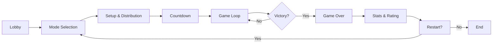

# WC3 Risk System — Gameplay Wiki

> Comprehensive gameplay documentation for the Warcraft III Risk System. This wiki covers every gameplay aspect including game modes, economy, combat, maps, victory conditions, ranking, and more.

---

## 📖 Table of Contents

### Core Systems

| Section | Description |
|---------|-------------|
| [🎮 Game Modes](./game-modes.md) | Standard, Promode, Capitals, W3C, and Equalized Promode modes |
| [🔄 Game Loop & Turns](./game-loop.md) | Turn structure, tick system, phase timing, day/night cycle |
| [💰 Economy & Income](./economy.md) | Income sources, country bonuses, gold mechanics, fight bonus |
| [⚔️ Units & Combat](./units.md) | All unit types, stats, abilities, guard system, spawning |
| [🏆 Victory & Elimination](./victory.md) | Win conditions, overtime, elimination, nomad state |

### Maps & Territories

| Section | Description |
|---------|-------------|
| [🗺️ Maps & Territories](./maps.md) | Europe, Asia, and World terrain overviews |
| [🏙️ Cities & Countries](./cities-countries.md) | City types, country bonuses, distribution, capitals |
| [🌊 Naval System](./naval.md) | Ports, ships, transport mechanics |

### Competitive & Social

| Section | Description |
|---------|-------------|
| [📊 Rating & Ranked](./rating.md) | ELO system, placement/kill pools, rank tiers |
| [🤝 Diplomacy & Teams](./diplomacy.md) | Alliance modes, team play, shared control |
| [💬 Commands](./commands.md) | All chat commands and player tools |

### Advanced

| Section | Description |
|---------|-------------|
| [🔧 Advanced Mechanics](./advanced.md) | Shared slots, fog of war, minimap, replay system |
| [📈 Scoreboard & Statistics](./scoreboard.md) | Scoreboard layout, stat tracking, MMD |

---

## Quick Reference

### Key Numbers

| Stat | Value |
|------|-------|
| Turn Duration | 60 seconds |
| Starting Income | 4 gold/turn |
| Cities to Win | 60% of total |
| Ranked Minimum Players | 16 |
| Starting Rating | 1000 |
| Max Starting Cities/Player | 22 |
| Nomad Duration | 60 seconds |
| Spawn Turn Limit | 5 turns |

### Game Flow at a Glance

### Supported Maps

| Map | Countries | Cities | Ports |
|-----|-----------|--------|-------|
| [Europe](./maps.md#europe) | 81 | 233 | 46 |
| [Asia](./maps.md#asia) | 82 | 229 | 32 |
| [World](./maps.md#world) | 212 | 555 | 74 |

---

## Source Code Reference

All gameplay systems are implemented in `src/app/` with configuration in `src/configs/`. Pure gameplay logic is extracted into `src/app/utils/` and `src/app/managers/` for testability. See individual pages for specific file references.
