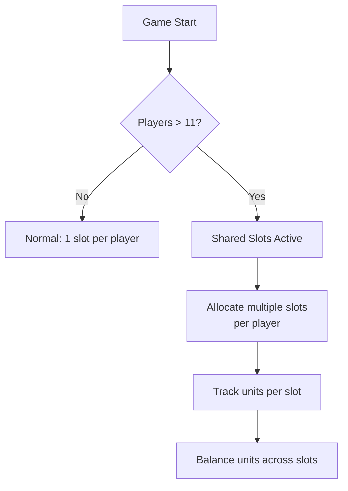
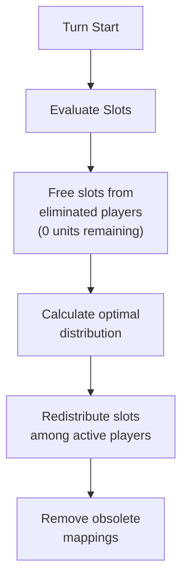
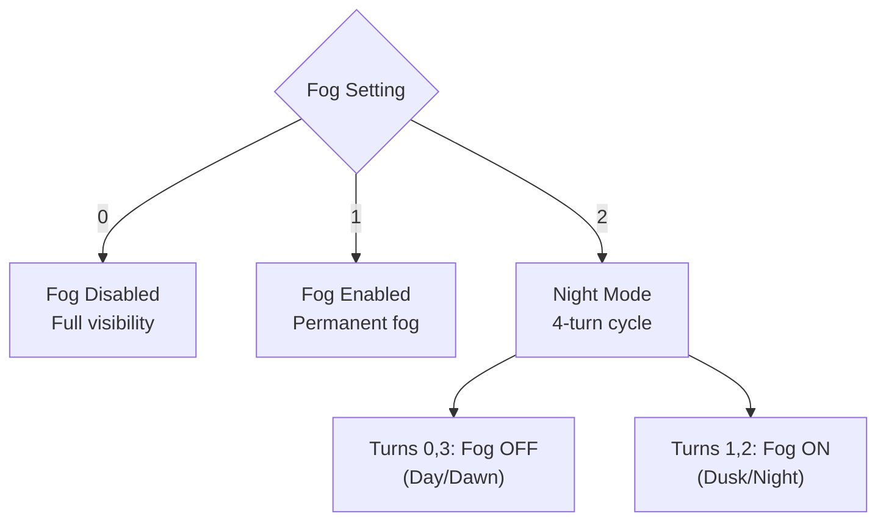
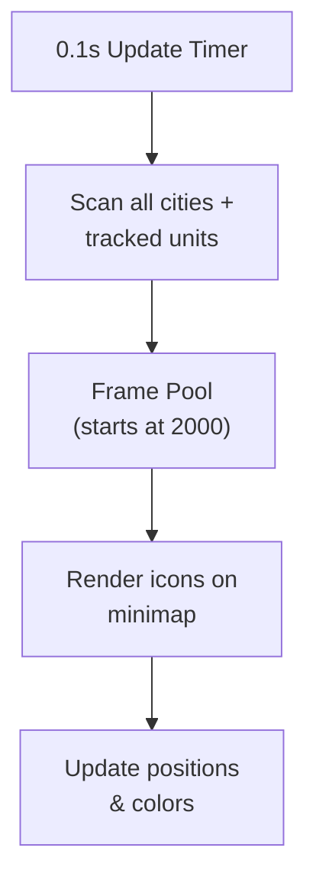
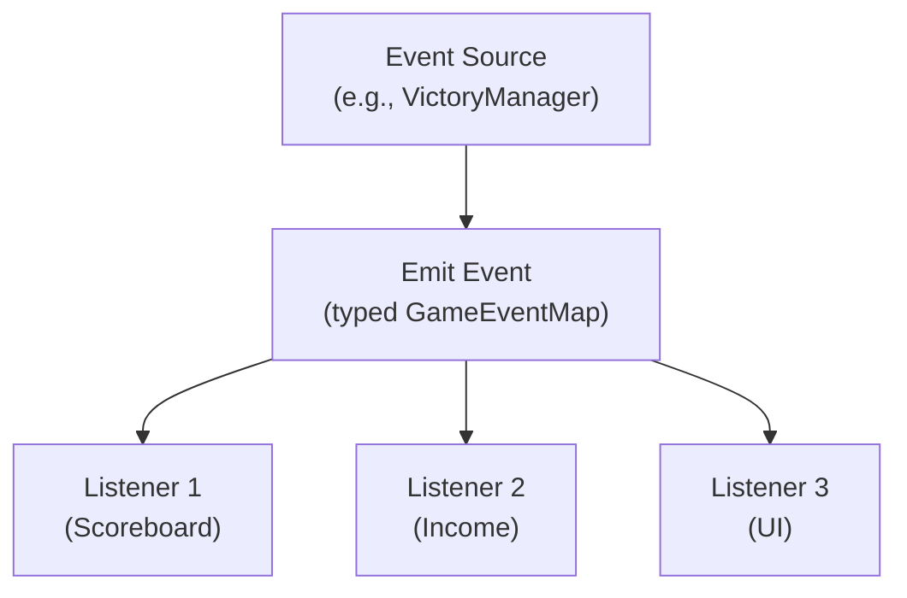
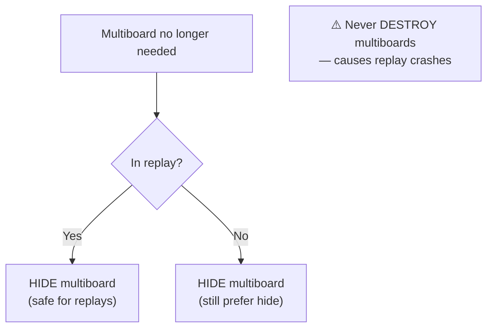
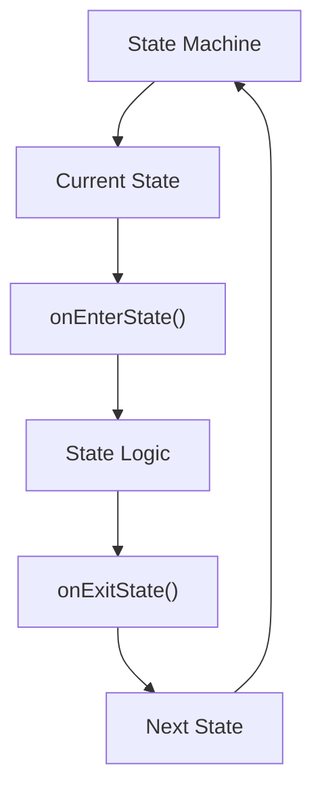

# 🔧 Advanced Mechanics

> This page covers the deeper systems that power WC3 Risk — shared slot allocation, fog of war, the minimap system, replay compatibility, and the event system.

[← Back to Wiki Home](./README.md)

---

## Table of Contents

- [Shared Slot System](#shared-slot-system)
- [Fog of War](#fog-of-war)
- [Minimap System](#minimap-system)
- [Event System](#event-system)
- [Replay System](#replay-system)
- [State Machine](#state-machine)
- [Ban List](#ban-list)

---

## Shared Slot System

WC3 has a hard limit of 24 player slots. When more than 11 human players join, the **shared slot system** activates to allocate multiple game slots per player.

### How It Works



### Configuration

| Setting | Value | Description |
|---------|-------|-------------|
| `MAX_PLAYERS_FOR_SHARED_SLOT_ALLOCATION` | 11 | Threshold to activate shared slots |
| `SHARED_SLOT_ALLOCATION_ENABLED` | true | Feature toggle |

### Redistribution

Each turn, the system evaluates slot allocation:



1. **Collect** — Identify active vs. eliminated players
2. **Free** — Reclaim slots from eliminated players with zero units
3. **Calculate** — Determine optimal distribution per active player
4. **Assign** — Redistribute slots evenly
5. **Cleanup** — Remove obsolete mappings

### Unit Placement

New units are assigned to the slot with the fewest units:
```
targetSlot = getSlotWithLowestUnitCount(player)
```

This ensures even distribution across a player's allocated slots.

---

## Fog of War

Fog of War (FoW) limits visibility, forcing strategic scouting.

### Fog Modes

| Mode | ID | Description |
|------|-----|-------------|
| **Off** | 0 | Full map visibility for all players |
| **On** | 1 | Permanent fog — only see around owned cities/units |
| **Night** | 2 | Day/night cycle — fog toggles every 2 turns |

### Implementation



### Night Cycle Details

See [Game Loop → Day/Night Cycle](./game-loop.md#daynight-cycle) for the complete 4-turn cycle.

### Observer Visibility

Observers **always** have full visibility regardless of fog settings:
- `FOG_OF_WAR_VISIBLE` applied to entire map for observers
- This applies in all fog modes

---

## Minimap System

The minimap shows unit positions as colored icons in real-time.

### Architecture



### Frame Pool

| Setting | Value | Description |
|---------|-------|-------------|
| Initial pool size | 2,000 | Starting number of minimap frames |
| Expansion step | 200 | Frames added when pool exhausted |
| Shrink behavior | Never | Pool only grows, never shrinks |

### Performance Characteristics

| Metric | Value | Notes |
|--------|-------|-------|
| Update frequency | 0.1 seconds | Processes all cities + units per tick |
| Cities per map | ~200-555 | Depending on terrain |
| Units at peak | ~1000 | With 18+ players and full spawns |
| Native calls/sec | ~90,000 | With 1000 units (estimated) |

### Custom Icons

When `FORCE_CUSTOM_MINIMAP_ICONS` is enabled (default: true):
- Custom colored icons replace default WC3 minimap dots
- Player colors are accurately represented
- Icons are hidden for guard units (to avoid clutter)

---

## Event System

WC3 Risk uses a typed event emitter with error boundaries for decoupled system communication.

### Architecture



### Key Events

| Event | Trigger | Listeners |
|-------|---------|-----------|
| `EVENT_ON_PLAYER_FORFEIT` | Player types `-ff` | Victory check, status update |
| `EVENT_ON_PLAYER_RESTART` | Player types `-restart` | Game reset |
| `EVENT_ON_PLAYER_STATUS_CHANGE` | Status transition | Scoreboard, UI, income |
| Country ownership change | City captured/lost | Income, labels, spawners |

### Error Boundaries

The event emitter includes error boundaries to prevent one listener's error from crashing others:
- Each listener callback is wrapped in try/catch
- Errors are logged but don't propagate
- Other listeners still receive the event

---

## Replay System

WC3 Risk has special handling for replay compatibility.

### Replay POV Detection

In replays, `GetLocalPlayer()` may not return the expected player. The system uses specialized detection:
- Detects whether the viewer is watching a replay
- Identifies the replay viewer's POV (point of view)
- Adjusts UI elements accordingly

### Replay Safety Rules

| System | Rule | Reason |
|--------|------|--------|
| **Multiboard** | Hide, don't destroy | Destroying multiboards crashes replays |
| **Scoreboard** | POV-aware rendering | Different data shown based on viewer |
| **Minimap** | FOW-compatible icons | Icons visible through fog in replays |
| **UI Frames** | Reuse over recreate | Avoid handle leaks in replay playback |

### Multiboard Safety



---

## State Machine

Game modes use a state machine pattern to manage phase transitions.

### Architecture



### State Interface

Each state implements:

| Method | Description |
|--------|-------------|
| `onEnterState()` | Called when entering this state |
| `onExitState()` | Called when leaving this state |

### State Transition

States advance sequentially through the mode's state array. The state machine:
1. Calls `onExitState()` on the current state
2. Advances the index
3. Calls `onEnterState()` on the next state

### Singleton Pattern

Key managers use the singleton pattern with test isolation:

```
getInstance()   → Get or create the single instance
resetInstance() → Destroy instance (for testing)
```

Five singletons support `resetInstance()`:
- PlayerManager
- IncomeManager
- VictoryManager
- SharedSlotManager
- SettingsContext

---

## Ban List

WC3 Risk maintains a ban list for disruptive players.

### Configuration

| Setting | Value |
|---------|-------|
| `BAN_LIST_ACTIVE` | true |

### Banned Players

Players on the ban list are automatically removed when they join:
- Ban list is checked during player initialization
- Banned players cannot participate in games
- List is maintained in source code

---

## Source Code Reference

| File | Purpose |
|------|---------|
| `src/app/game/services/shared-slot-manager.ts` | Shared slot allocation |
| `src/app/managers/fog-manager.ts` | Fog of war management |
| `src/app/utils/events/event-emitter.ts` | Typed event system |
| `src/app/utils/events/event-constants.ts` | Event name constants |
| `src/app/utils/events/event-map.ts` | Event type map |
| `src/app/libs/state-machine.ts` | State machine implementation |
| `src/app/statistics/replay-manager.ts` | Replay system |
| `docs/replay/` | Replay-specific documentation |
| `docs/shared-slots/` | Shared slot documentation |

---

[← Commands](./commands.md) · [Back to Wiki Home](./README.md) · [Scoreboard & Statistics →](./scoreboard.md)
