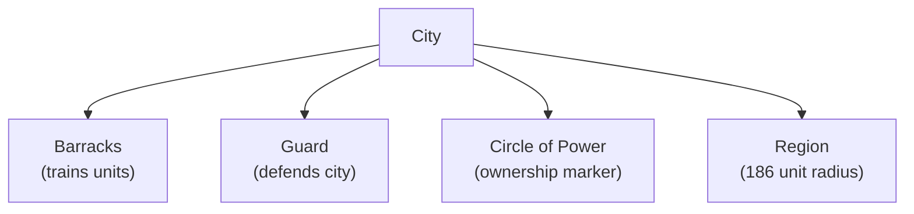
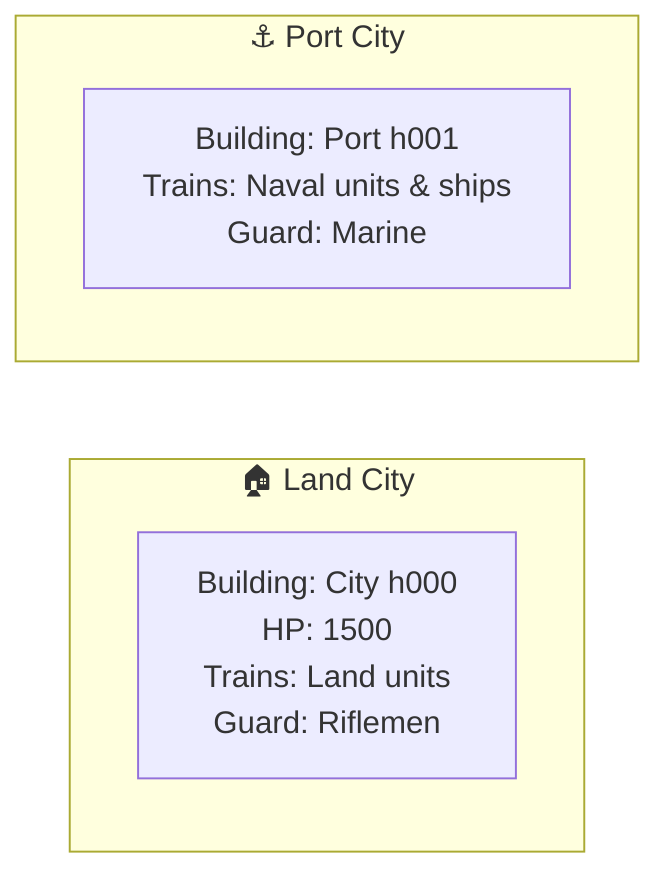
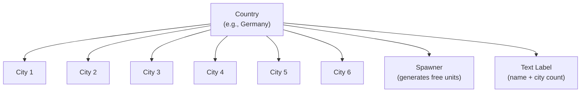
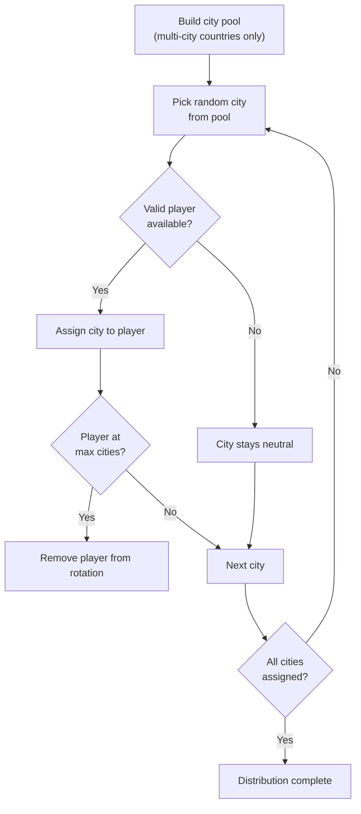
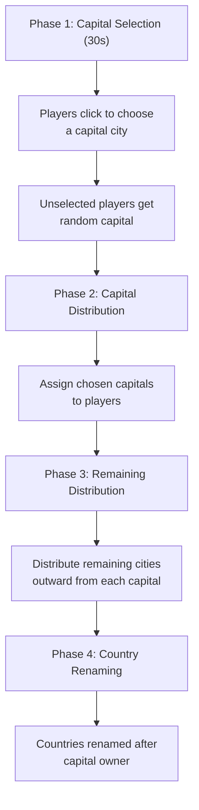
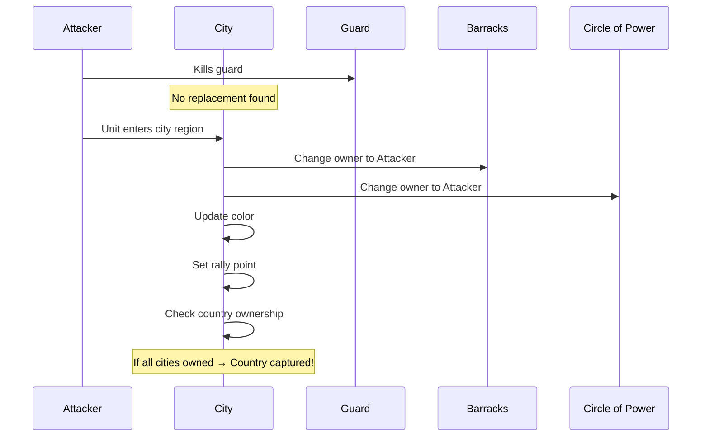

# 🏙️ Cities & Countries

> Cities are the fundamental territorial units in WC3 Risk. Countries group cities together and provide income bonuses when fully controlled. This page covers city types, country mechanics, distribution, and the Capitals mode system.

[← Back to Wiki Home](./README.md)

---

## Table of Contents

- [City Basics](#city-basics)
- [City Types](#city-types)
- [City Components](#city-components)
- [Country System](#country-system)
- [City Distribution](#city-distribution)
- [Country Balance Constraint](#country-balance-constraint)
- [Capitals Mode](#capitals-mode)
- [City Ownership Changes](#city-ownership-changes)

---

## City Basics

A **city** is a capturable location on the map. Each city has:
- A **barracks** (the main building that trains units)
- A **guard** (defensive unit)
- A **circle of power** (ownership indicator)
- A **region** (area of influence, 186 unit radius)



### City Configuration

| Setting | Value | Description |
|---------|-------|-------------|
| `CityRegionSize` | 186 | World-coordinate radius of city influence |
| `CityGuardXOffSet` | 125 | Guard X position offset from city center |
| `CityGuardYOffSet` | 255 | Guard Y position offset from city center |
| `DefaultCityType` | `'land'` | Default city type if not specified |
| `DefaultGuardType` | Riflemen | Default guard unit type |
| `DefaultBarrackType` | City (`h000`) | Default barracks building |
| `DefaultSpawnType` | Riflemen | Default spawned unit type |

---

## City Types

There are two types of cities:



| Property |  Land City |  Port City |
|----------|-----------|-----------|
| Building ID | `h000` (CITY) | `h001` (PORT) |
| HP | 1,500 | — |
| Trains | Land units (Riflemen → Tank) | Naval units + Ships |
| Default Guard | Riflemen | Marine |
| Location | Inland | Coastal |

### Port Distribution by Map

| Map | Total Cities | Ports | Land | Port % |
|-----|-------------|-------|------|--------|
| Europe | 233 | 46 | 187 | 19.7% |
| Asia | 229 | 32 | 197 | 14.0% |
| World | 555 | 74 | 481 | 13.3% |

---

## City Components

### Barracks

The barracks is the main building at each city. Players can train units by spending gold.
- Default owner: Neutral Hostile (before distribution)
- Rally point: Set to default position + offset
- Changes color when captured

### Guard

Each city has a defensive guard unit. See [Units & Combat → Guard System](./units.md#guard-system) for full details.

### Circle of Power (COP)

A visual indicator showing city ownership:
- Changes owner and color when the city is captured
- Used by the game to track territory control

### Rally Point

Cities have a rally point where newly trained units appear:
- Set relative to the barracks position
- Can be customized by the player

---

## Country System

Countries are groups of 1-8 cities. Controlling all cities in a country awards an income bonus.



### Country Properties

| Property | Description |
|----------|-------------|
| **Name** | Display name (e.g., "Germany", "France") |
| **Cities** | Array of 1-8 city objects |
| **Spawner** | Unit that generates free troops each turn |
| **Owner** | Player who controls the country (all cities) |
| **Label** | Floating text showing name and city count |

### Country Income Bonus

```
Bonus = Number of cities in country (awarded only when ALL cities are owned)

Example: Germany (6 cities)
  → Control all 6 = +6 income/turn
  → Lose even 1 = bonus removed entirely
```

### Country Label

Each country has a floating text label:
- Positioned above the spawner (offset: -100, -300)
- Shows country name and city count
- Visibility can be toggled with `-names` command

---

## City Distribution

At game start, cities are distributed among players using one of three algorithms.

### Standard Distribution



### Distribution Rules

| Rule | Formula | Description |
|------|---------|-------------|
| Max cities/player | `min(⌊totalCities / numPlayers⌋, 22)` | Upper bound per player |
| Country constraint | `< ⌊countryCities / 2⌋` | Cannot own 50%+ of any country |
| Eligible cities | Multi-city countries only | Single-city countries stay neutral |

### Capital Distribution (Capitals Mode)

1. Players choose a capital city (30-second selection phase)
2. Capital cities assigned first
3. Remaining cities distributed outward from each capital
4. Countries renamed after their capital's owner

### Equalized Distribution

- **Match 1:** Random distribution (same as Standard)
- **Match 2:** Same city assignments, swapped between players
- Ensures fairness across two-match series

---

## Country Balance Constraint

To prevent one player from dominating a single country early, distribution enforces a balance rule:

```
Player can own at most: ⌊countryCities / 2⌋ - 1 cities per country
(Less than 50% of any single country's cities)
```

### Examples

| Country | Cities | Max Per Player | Explanation |
|---------|--------|---------------|-------------|
| France | 8 | 3 | ⌊8/2⌋ - 1 = 3 |
| Germany | 6 | 2 | ⌊6/2⌋ - 1 = 2 |
| Poland | 4 | 1 | ⌊4/2⌋ - 1 = 1 |
| Czechia | 2 | 0 | ⌊2/2⌋ - 1 = 0 (only 1 can be assigned) |
| Malta | 1 | N/A | Single-city: excluded from distribution |

> This means no player starts with a full country bonus — all bonuses must be earned through gameplay.

---

## Capitals Mode

In Capitals mode, the distribution is fundamentally different:



### Capital Buildings

| Building | ID | Description |
|----------|-----|-------------|
| **Capital** | `h005` | Active capital (player's home base) |
| **Conquered Capital** | `h006` | Captured enemy capital |

### Strategic Implications

- Capital location determines your starting territory
- Adjacent cities are more likely to be assigned to you
- Losing your capital doesn't eliminate you, but losing it loses its strategic advantage
- Country names change to reflect ownership, adding a personal touch

---

## City Ownership Changes

When a city changes hands:



### What Happens on Capture

1. Guard is killed or no guard present
2. Attacking unit enters the city's 186-unit radius region
3. Barracks ownership changes
4. Circle of Power ownership changes
5. City color updates to new owner's color
6. Rally point adjusts
7. Country ownership checked — if all cities now owned, country bonus awarded
8. Previous owner's income recalculated

---

## Source Code Reference

| File | Purpose |
|------|---------|
| `src/app/city/` | City implementation (LandCity, PortCity) |
| `src/app/country/` | Country implementation |
| `src/configs/city-settings.ts` | City configuration constants |
| `src/configs/country-settings.ts` | Country/spawner defaults |
| `src/app/game/services/distribution-service/` | City distribution algorithms |
| `src/app/game/services/distribution-service/distribution-logic.ts` | Pure distribution logic |

---

[← Maps & Territories](./maps.md) · [Back to Wiki Home](./README.md) · [Naval System →](./naval.md)
