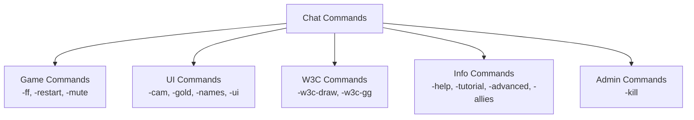
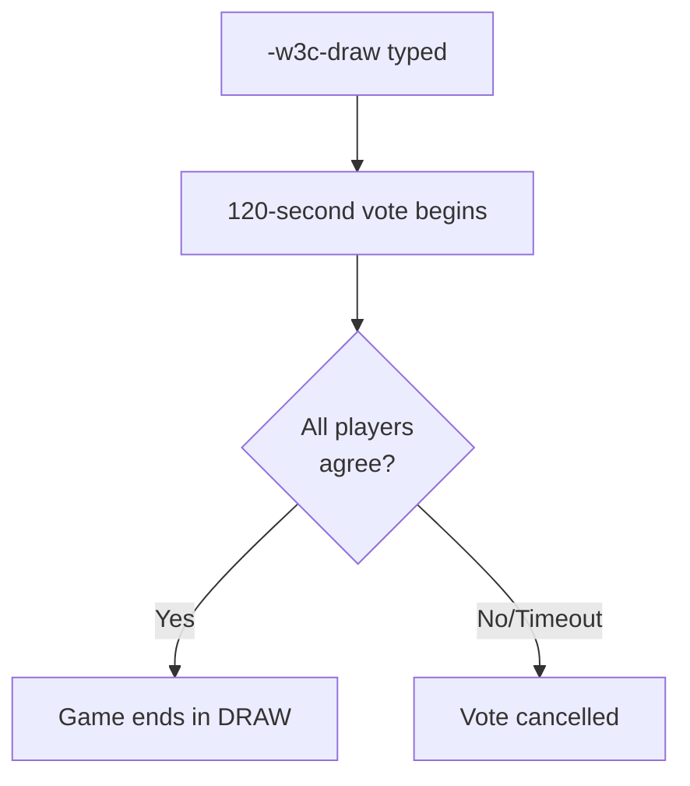
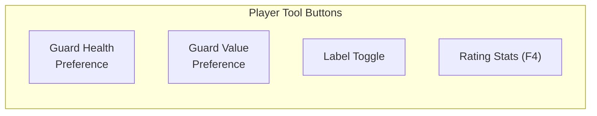

# 💬 Commands

> WC3 Risk provides a comprehensive set of chat commands for player interaction, game control, and customization. Type commands in the chat box during gameplay.

[← Back to Wiki Home](./README.md)

---

## Table of Contents

- [Command Overview](#command-overview)
- [Game Commands](#game-commands)
- [UI & Display Commands](#ui--display-commands)
- [W3C Commands](#w3c-commands)
- [Info Commands](#info-commands)
- [Admin Commands](#admin-commands)

---

## Command Overview



---

## Game Commands

### `-ff` / `-forfeit`
**Forfeit the game and concede defeat.**

| Detail | Value |
|--------|-------|
| Aliases | `-ff`, `-forfeit` |
| Effect | Sets player status to DEAD |
| Condition | Game must not be in post-match state |
| Event | Emits `EVENT_ON_PLAYER_FORFEIT` |
| Triggers | Victory check (may end game if last player) |

```
Example:
  Player types: -ff
  → "Player A has forfeited the game!"
  → Player A is eliminated
  → Victory check runs
```

### `-restart` / `-ng` / `-newgame`
**Request a new game (restart).**

| Detail | Value |
|--------|-------|
| Aliases | `-ng`, `-newgame`, `-restart` |
| Effect | Triggers game restart sequence |
| Event | Emits `EVENT_ON_PLAYER_RESTART` |
| Note | If last human player, triggers game end |

### `-mute`
**Mute a player for 5 minutes.**

| Detail | Value |
|--------|-------|
| Duration | 300 seconds (5 minutes) |
| Effect | Sets target player's status to STFU |
| Status Color | Gold (`|cfffe890dSTFU|r`) |
| Note | Muted player can still play, just can't chat |

---

## UI & Display Commands

### `-cam` / `-zoom`
**Adjust camera view.**

| Detail | Value |
|--------|-------|
| Aliases | `-cam`, `-zoom` |
| Effect | Updates camera via CameraManager |
| Scope | Only affects the player who types it |

### `-gold`
**Toggle gold display.**

| Detail | Value |
|--------|-------|
| Effect | Shows/hides gold information on screen |
| Scope | Local to typing player |

### `-names`
**Toggle country name labels.**

| Detail | Value |
|--------|-------|
| Effect | Shows/hides floating country name labels |
| Scope | All players (visibility toggle) |
| Related | Country labels show name + city count |

### `-ui`
**UI settings and customization.**

| Detail | Value |
|--------|-------|
| Effect | Opens UI settings panel |
| Options | Various display preferences |

---

## W3C Commands

These commands are only available in W3C Mode (competitive W3Champions platform):

### `-w3c-draw`
**Initiate a draw vote.**

| Detail | Value |
|--------|-------|
| Duration | 120 seconds to vote |
| Requirement | All remaining players must agree |
| Effect | If unanimous, game ends in a draw |



### `-w3c-gg`
**Concede the game (Good Game).**

| Detail | Value |
|--------|-------|
| Effect | Player concedes defeat |
| Equivalent | Similar to `-ff` but W3C-specific |
| Etiquette | Standard competitive concession |

---

## Info Commands

### `-help`
**Display available commands and basic help.**

| Detail | Value |
|--------|-------|
| Effect | Shows list of available commands |
| Content | Command names and brief descriptions |

### `-tutorial` / `-howto`
**Display gameplay tutorial and tips.**

| Detail | Value |
|--------|-------|
| Aliases | `-tutorial`, `-howto` |
| Content | Gameplay basics, how to capture cities, etc. |

### `-advanced`
**Display advanced gameplay information.**

| Detail | Value |
|--------|-------|
| Content | Advanced mechanics and strategies |

### `-allies`
**Display current alliance/team information.**

| Detail | Value |
|--------|-------|
| Content | Lists team members (team modes) or allied players (FFA) |
| Mode-dependent | Shows different info based on diplomacy mode |

---

## Admin Commands

### `-kill`
**Kill a player (admin only).**

| Detail | Value |
|--------|-------|
| Access | Admin/developer only |
| Effect | Immediately eliminates target player |
| Use | Testing and moderation |

---

## Command Summary Table

| Command | Aliases | Category | Description |
|---------|---------|----------|-------------|
| `-ff` | `-forfeit` | Game | Forfeit/concede |
| `-restart` | `-ng`, `-newgame` | Game | Restart game |
| `-mute` | — | Game | Mute player (300s) |
| `-cam` | `-zoom` | UI | Camera controls |
| `-gold` | — | UI | Toggle gold display |
| `-names` | — | UI | Toggle country labels |
| `-ui` | — | UI | UI settings |
| `-w3c-draw` | — | W3C | Initiate draw vote |
| `-w3c-gg` | — | W3C | Concede (W3C) |
| `-help` | — | Info | Show help |
| `-tutorial` | `-howto` | Info | Show tutorial |
| `-advanced` | — | Info | Advanced tips |
| `-allies` | — | Info | Show alliances/team |
| `-kill` | — | Admin | Kill player |

---

## Player Preference Buttons

In addition to chat commands, players have UI buttons for guard preferences:



| Button | Function | Related Ability |
|--------|----------|----------------|
| Guard Health | Toggle low/high HP guard preference | `a051` / `a052` |
| Guard Value | Toggle low/high value guard preference | `a053` / `a054` |
| Labels | Toggle country name labels | — |
| Rating Stats (F4) | Open rating statistics panel | — |

---

## Source Code Reference

| File | Purpose |
|------|---------|
| `src/app/commands/forfeit.ts` | Forfeit command |
| `src/app/commands/restart.ts` | Restart command |
| `src/app/commands/allies.ts` | Alliance display |
| `src/app/commands/cam.ts` | Camera command |
| `src/app/commands/` | All command implementations |
| `src/app/ui/` | UI button implementations |
| `src/app/quests/quests.ts` | Quest/help system |

---

[← Diplomacy & Teams](./diplomacy.md) · [Back to Wiki Home](./README.md) · [Advanced Mechanics →](./advanced.md)
