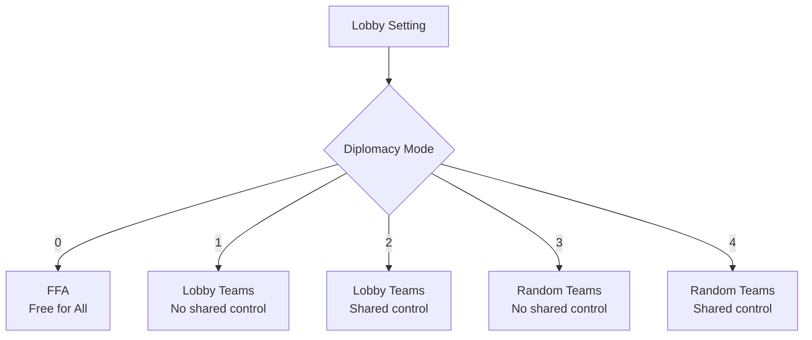
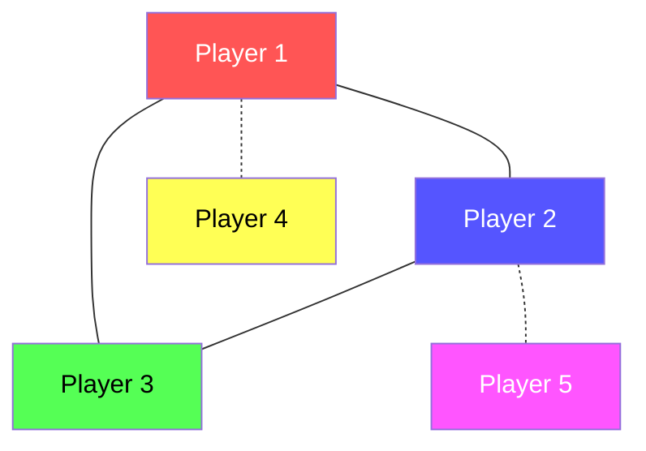
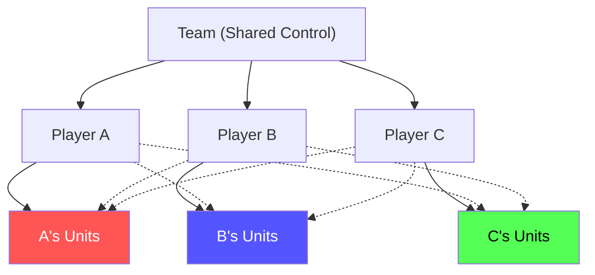
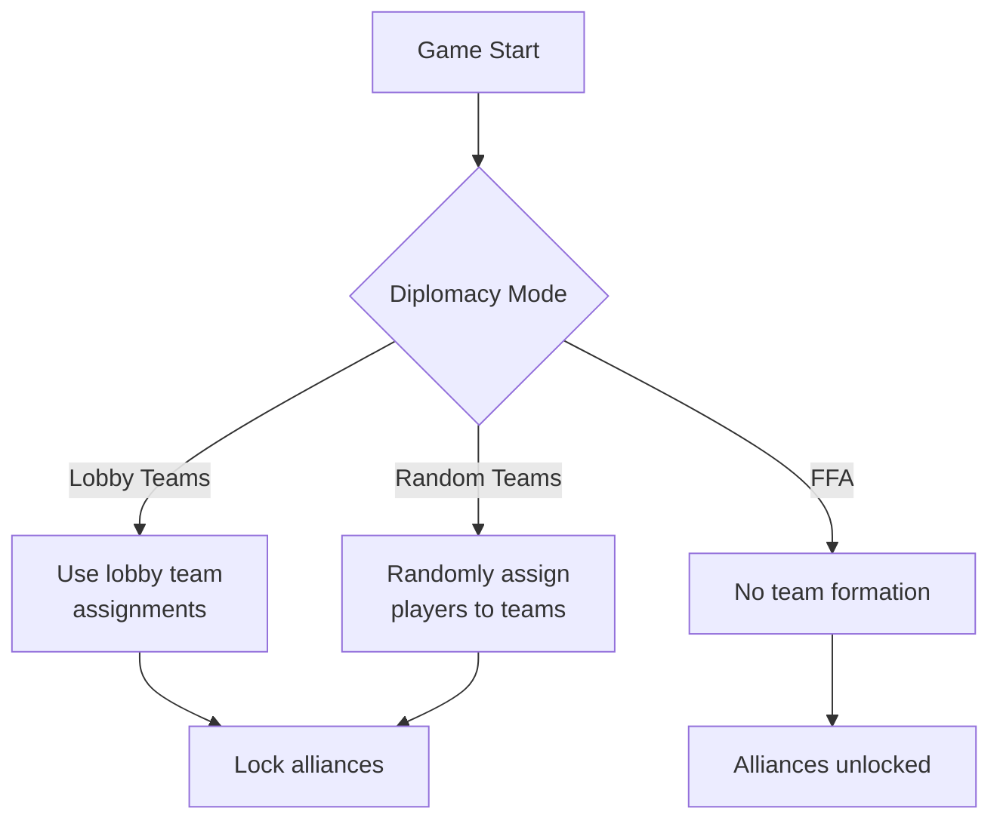
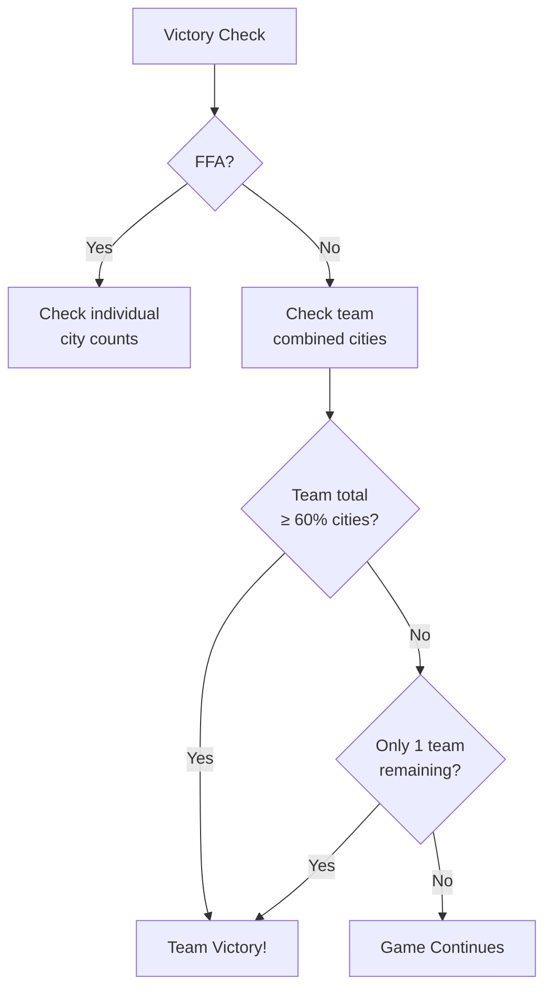

# Diplomacy & Teams

> WC3 Risk supports both free-for-all and team-based gameplay with five diplomacy modes. This page covers alliance mechanics, team configurations, and how teams affect gameplay.

[← Back to Wiki Home](./README.md)

---

## Table of Contents

- [Diplomacy Modes](#diplomacy-modes)
- [FFA (Free for All)](#ffa-free-for-all)
- [Lobby Teams](#lobby-teams)
- [Random Teams](#random-teams)
- [Shared Control](#shared-control)
- [Team Mechanics](#team-mechanics)
- [Team Victory](#team-victory)
- [Alliance Commands](#alliance-commands)

---

## Diplomacy Modes

The diplomacy setting is chosen in the game lobby and determines team structure:



### Mode Summary

| Mode | ID | Teams | Shared Control | Alliance Changes |
|------|----|-------|---------------|-----------------|
| **FFA** | 0 | None | No | Allowed (via menu) |
| **Lobby Teams** | 1 | Pre-set | No | Locked |
| **Lobby Teams (Shared)** | 2 | Pre-set | Yes | Locked |
| **Random Teams** | 3 | Random | No | Locked |
| **Random Teams (Shared)** | 4 | Random | Yes | Locked |

---

## FFA (Free for All)

The default competitive mode — every player for themselves.

### Rules
- No permanent alliances
- Players can form temporary alliances via the game menu
- Alliance changes are **not locked** — betrayal is always possible
- Ranked games require FFA mode with 16+ players
- Eliminated players' units receive damage-over-time debuffs



> In FFA, everyone is your potential enemy. Temporary alliances are strategic tools, not binding agreements.

---

## Lobby Teams

Players form teams in the game lobby before the match starts.

### Without Shared Control (Mode 1)
- Teams are locked at game start
- Each player controls only their own units
- Alliance changes are **locked** (`MAP_LOCK_ALLIANCE_CHANGES = true`)
- Teammates cannot control each other's armies

### With Shared Control (Mode 2)
- Same as Mode 1, plus:
- Teammates can control each other's units (`allowFullSharedControl()`)
- When a teammate is eliminated, surviving teammates retain control of their units
- More cooperative than Mode 1

---

## Random Teams

Teams are randomly assigned at game start.

### Without Shared Control (Mode 3)
- Players are randomly grouped into teams
- Alliance changes locked
- Each player controls only their own units

### With Shared Control (Mode 4)
- Random team assignment
- Full shared unit control between teammates
- Most cooperative team mode

---

## Shared Control

When shared control is enabled (Modes 2 and 4):



### What Shared Control Allows
- Control any teammate's units (move, attack, retreat)
- Train units at teammate's cities
- Coordinate defense and offense seamlessly

### Elimination in Team Mode
- When a teammate is eliminated, their units are **retained by surviving teammates**
- No damage-over-time debuff (unlike FFA elimination)
- The team continues fighting with all accumulated units

---

## Team Mechanics

### Team Data Structure

Each team tracks aggregate statistics:

| Stat | Description |
|------|-------------|
| `totalCities` | Sum of all team members' cities |
| `totalIncome` | Sum of all team members' income |
| `totalKills` | Sum of all team members' kills |
| `totalDeaths` | Sum of all team members' deaths |
| `members` | Array of team member players |
| `isEliminated` | Whether the entire team is eliminated |

### Team Formation



### Team Numbers

- Teams are numbered 1 through `bj_MAX_PLAYERS`
- Each player's team is determined by `GetPlayerTeam() + 1`
- The team manager groups players automatically

---

## Team Victory

### FFA Victory
- Individual player must control 60% of cities OR be the last standing

### Team Victory
- Team's combined city count must reach the threshold
- If all other teams are eliminated, surviving team wins
- A team is eliminated only when **all** members are eliminated



---

## Alliance Commands

### `-allies` Command

Displays current team members and alliance status:

```
/allies
→ Your team: Player A, Player B, Player C
→ Allied with: (none) / (list of allied players)
```

### FFA Alliance Menu

In FFA mode, players can use the in-game alliance menu to:
- Offer alliance to other players
- Accept incoming alliance requests
- Break existing alliances

> **Warning:** In FFA, alliances are non-binding. Any player can break an alliance at any time.

---

## Impact on Other Systems

### Ranked Games
- **Only FFA games are ranked** — Team games do not affect ratings
- Minimum 16 players required for ranked
- Team modes are for casual/custom play

### Elimination Behavior

| Mode | On Elimination | Units | Income |
|------|---------------|-------|--------|
| **FFA** | Units get DoT debuff | Debuffed | 1 gold/turn |
| **Teams** | Teammates take control | Retained | 0 (teammate handles) |

### Scoreboard

| Mode | Display |
|------|---------|
| **FFA** | Individual player rows |
| **Teams** | Team rows with aggregated stats |

---

## Source Code Reference

| File | Purpose |
|------|---------|
| `src/app/settings/strategies/diplomacy-strategy.ts` | Diplomacy mode implementation |
| `src/app/teams/` | Team manager and team structure |
| `src/app/commands/allies.ts` | Alliance command |
| `src/configs/game-settings.ts` | Diplomacy settings |

---

[← Rating & Ranked](./rating.md) · [Back to Wiki Home](./README.md) · [Commands →](./commands.md)

