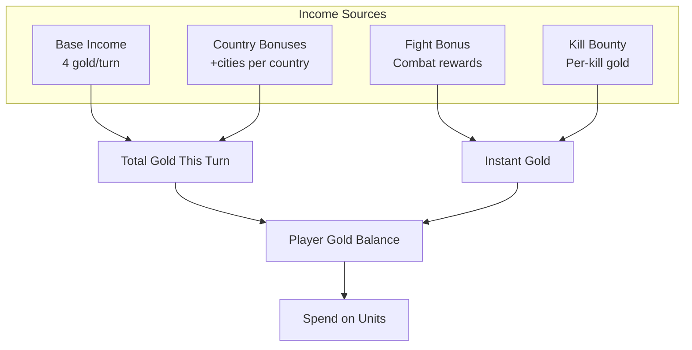
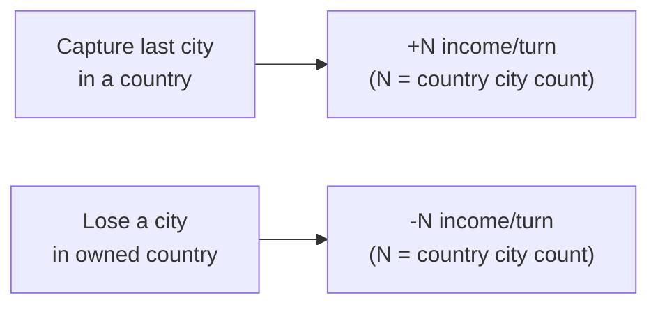
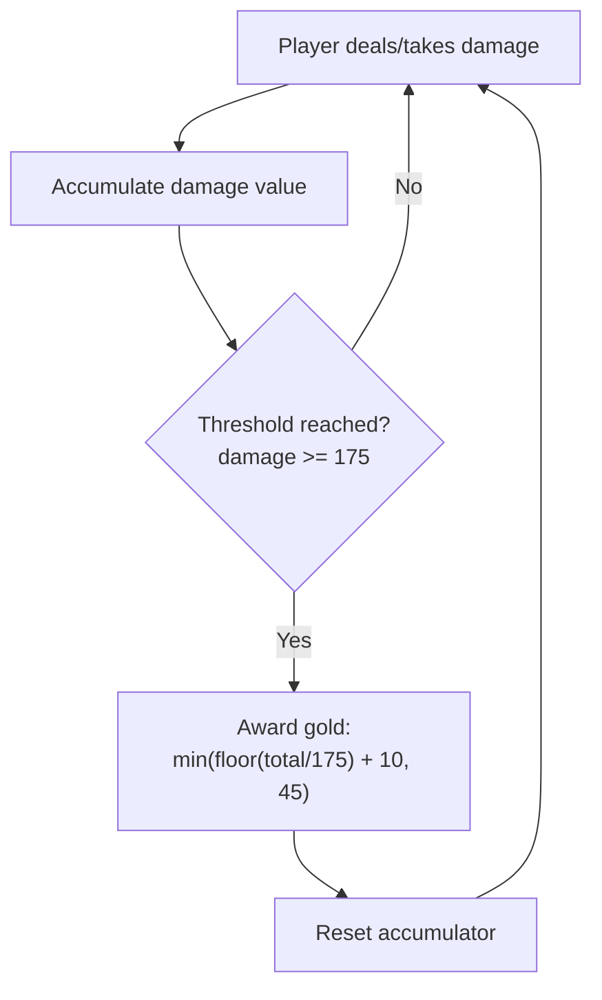
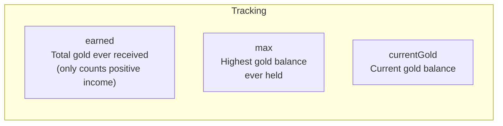
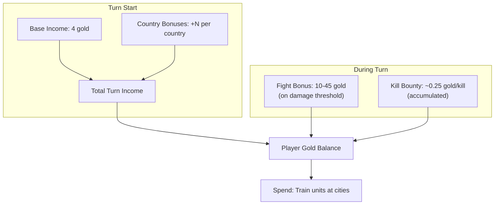

# Economy & Income

> Gold is the primary resource in WC3 Risk. Players earn income each turn from base income, country bonuses, and combat rewards. This page covers all economic mechanics.

[← Back to Wiki Home](./README.md)

---

## Table of Contents

- [Income Overview](#income-overview)
- [Base Income](#base-income)
- [Country Bonuses](#country-bonuses)
- [Fight Bonus](#fight-bonus)
- [Kill Bounty](#kill-bounty)
- [Gold Tracking](#gold-tracking)
- [Income by Player Status](#income-by-player-status)
- [Economy Flow Diagram](#economy-flow-diagram)
- [Examples](#examples)

---

## Income Overview

Gold is earned from multiple sources each turn:



---

## Base Income

Every player receives a base income at the start of each turn.

| Mode | Starting Income | Notes |
|------|----------------|-------|
| Standard | **4 gold/turn** | Default for all standard modes |
| Promode | **4 gold/turn** | Same as Standard |
| Chaos Promode | **25 gold/turn** | Significantly accelerated economy |
| Capitals | **4 gold/turn** | Same as Standard |
| W3C | **4 gold/turn** | Same as Standard |
| Equalized | **4 gold/turn** | Same as Standard |

Income is distributed at the start of each turn via `IncomeManager.giveIncome()`.

---

## Country Bonuses

Controlling all cities in a country awards bonus income equal to the country's city count.

### How It Works



### Formula

```
Country Bonus = Number of cities in the country

Example: Germany has 6 cities
  → Controlling all 6 = +6 income/turn
  → Losing one city = -6 income/turn (bonus removed)
```

### Example Country Bonuses (Europe)

| Country | Cities | Bonus |
|---------|--------|-------|
| France | 8 | +8/turn |
| Türkiye | 7 | +7/turn |
| Germany | 6 | +6/turn |
| Ukraine | 6 | +6/turn |
| Finland | 5 | +5/turn |
| Sweden | 5 | +5/turn |
| Central Russia | 5 | +5/turn |
| Poland | 4 | +4/turn |
| Spain | 4 | +4/turn |
| England | 3 | +3/turn |
| Czechia | 2 | +2/turn |
| Malta | 1 | +1/turn |

> **Tip:** Larger countries give bigger bonuses but are harder to hold. Small 2-city countries are quick captures for early income.

---

## Fight Bonus

Players earn gold for participating in combat based on accumulated damage.

### Parameters

| Parameter | Value | Description |
|-----------|-------|-------------|
| `BASE` | 10 | Minimum gold per bonus trigger |
| `CAP` | 45 | Maximum gold per trigger |
| `INTERVAL` | 175 | Damage needed to trigger |
| `UI_MAX_VALUE` | 100 | UI progress bar maximum |

### Formula

```
bonusAmount = floor(totalBonusValue / INTERVAL) + BASE
bonusAmount = min(bonusAmount, CAP)
```

### How It Works



### Example Fight Bonus Rewards

| Accumulated Damage | Calculation | Gold Awarded |
|-------------------|-------------|-------------|
| 175 | floor(175/175) + 10 = 11 | 11 |
| 350 | floor(350/175) + 10 = 12 | 12 |
| 1750 | floor(1750/175) + 10 = 20 | 20 |
| 6125+ | floor(6125/175) + 10 = 45 | 45 (capped) |

---

## Kill Bounty

Killing enemy units awards a small gold bounty.

### Parameters

| Parameter | Value | Description |
|-----------|-------|-------------|
| `Bounty Factor` | 0.25 | 25% of kill value |
| `Bounty Interval` | 1 | Gold per interval of accumulated bounty |

### Formula

```
bonusAmount = floor(delta)
where delta += killValue × 0.25
```

### Example

```
Kill a Rifleman (value ~1): delta += 1 × 0.25 = 0.25
Kill 4 Riflemen: delta = 1.0 → award 1 gold
Kill a Knight (value ~4): delta += 4 × 0.25 = 1.0 → award 1 gold
```

---

## Gold Tracking

The game tracks three gold metrics per player:



### Update Logic

```
On receiving income:
  newGold = currentGold + incomeAmount
  if (incomeAmount >= 1): earned += incomeAmount
  if (newGold > max): max = newGold
```

---

## Income by Player Status

A player's income depends on their current status:

| Status | Income | Description |
|--------|--------|-------------|
| 🟢 **ALIVE** | Full income (base + bonuses) | Normal gameplay |
| 🟠 **NOMAD** | 4 gold/turn | Lost all cities, has surviving units |
| 🔴 **DEAD** | 1 gold/turn | Eliminated from play |
| ⬛ **LEFT** | 0 gold/turn | Disconnected |
| 🟡 **STFU** | Normal income | Muted but still playing |

> **Note:** Nomad players receive the base income of 4 gold regardless of any country bonuses they previously held. Dead players get a minimal 1 gold/turn as a courtesy.

---

## Economy Flow Diagram

Complete gold flow for one turn:



---

## Examples

### Example 1: Early Game Income

```
Turn 1:
  Base income:      4 gold
  Countries held:   0 (no full countries yet)
  ─────────────────────
  Total income:     4 gold/turn
  Gold balance:     4 gold
```

### Example 2: Mid Game with Country Bonuses

```
Turn 10:
  Base income:      4 gold
  Countries held:
    - Czechia (2 cities): +2
    - Austria (3 cities): +3
  ─────────────────────
  Total income:     9 gold/turn
  Fight bonus:     ~15 gold (accumulated from combat)
  Gold balance:    ~50 gold
```

### Example 3: Late Game Domination

```
Turn 25:
  Base income:      4 gold
  Countries held:
    - Germany (6 cities):   +6
    - France (8 cities):    +8
    - Poland (4 cities):    +4
    - Belgium (2 cities):   +2
    - Netherlands (2 cities): +2
  ─────────────────────
  Total income:     26 gold/turn
  Accumulated:    ~300+ gold earned
```

### Example 4: Chaos Promode Economy

```
Turn 1 (Chaos Promode):
  Base income:     25 gold
  Countries held:   0
  ─────────────────────
  Total income:    25 gold/turn
  → 6.25× faster economy than Standard!
```

---

## Source Code Reference

| File | Purpose |
|------|---------|
| `src/app/managers/income-manager.ts` | Income distribution each turn |
| `src/app/managers/income-logic.ts` | Pure income calculation logic |
| `src/app/player/bonus/bounty.ts` | Kill bounty system |
| `src/app/player/bonus/fight-bonus.ts` | Fight bonus system |
| `src/configs/game-settings.ts` | `STARTING_INCOME`, `CHAOS_STARTING_INCOME` |

---

[← Game Loop & Turns](./game-loop.md) · [Back to Wiki Home](./README.md) · [Units & Combat →](./units.md)

