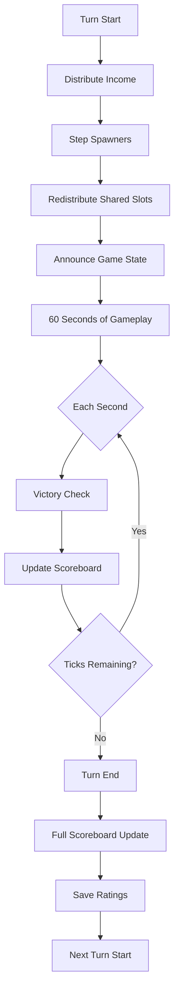
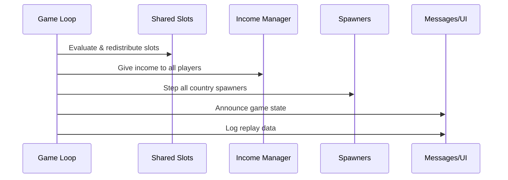
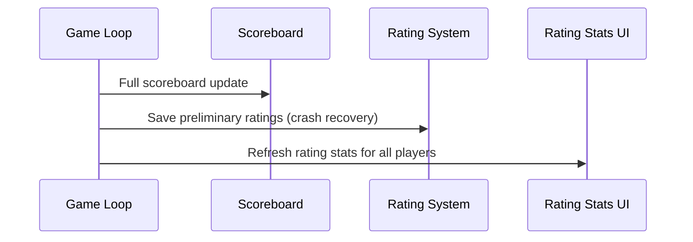
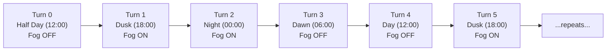
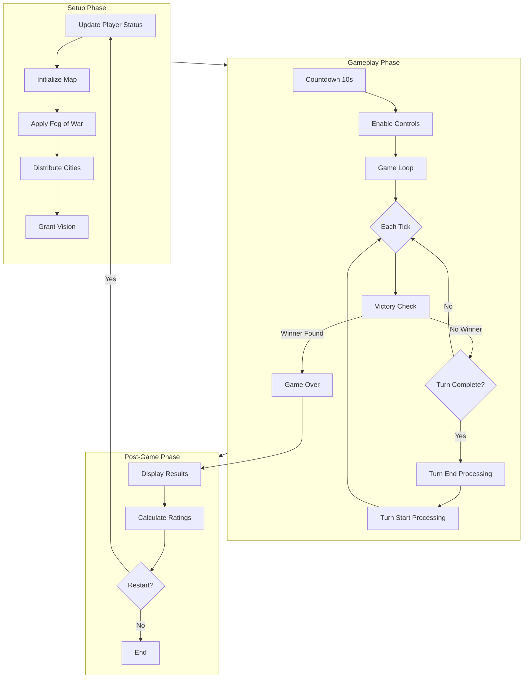

# 🔄 Game Loop & Turns

> The game loop is the heartbeat of WC3 Risk. Each turn lasts 60 seconds, divided into 60 ticks of 1 second each. This page covers the full turn lifecycle, timing, and day/night cycle.

[← Back to Wiki Home](./README.md)

---

## Table of Contents

- [Turn Structure](#turn-structure)
- [Tick System](#tick-system)
- [Turn Start Phase](#turn-start-phase)
- [Turn End Phase](#turn-end-phase)
- [Day/Night Cycle](#daynight-cycle)
- [Countdown Phase](#countdown-phase)
- [Match Lifecycle](#match-lifecycle)

---

## Turn Structure

Each game turn follows a predictable cycle:



### Timing Constants

| Constant | Value | Description |
|----------|-------|-------------|
| `TURN_DURATION_IN_SECONDS` | 60 | Seconds per turn |
| `TICK_DURATION_IN_SECONDS` | 1 | Seconds per tick |
| `STARTING_COUNTDOWN` | 10 | Pre-game countdown seconds |
| `NOMAD_DURATION` | 60 | Seconds a player stays in Nomad state |
| `STFU_DURATION` | 300 | Mute duration (5 minutes) |
| `W3C_DRAW_DURATION` | 120 | W3C draw vote duration |
| `CAPITALS_SELECTION_PHASE` | 30 | Capital selection time |

---

## Tick System

The game runs on a timer that fires every 1 second (one tick). Each tick:

```
┌─────────────────────────────────────────────────┐
│                   EACH TICK                     │
├─────────────────────────────────────────────────┤
│ 1. Check for last active player (auto-victory)  │
│ 2. Run onTick() — scoreboard partial update     │
│ 3. Process victory state changes                │
│ 4. Decrement tick counter                       │
│ 5. If counter reaches 0 → trigger turn end/start│
└─────────────────────────────────────────────────┘
```

### Tick Counter Flow

```
Turn Start: tickCounter = 60
  Tick 1: tickCounter = 59
  Tick 2: tickCounter = 58
  ...
  Tick 59: tickCounter = 1
  Tick 60: tickCounter = 0 → onEndTurn() → tickCounter = 60 → onStartTurn()
```

---

## Turn Start Phase

At the beginning of each turn, five operations execute in order:



### 1. Shared Slot Redistribution
- Recalculate slot ownership for games with 12+ players
- Free slots from eliminated players with zero units
- Redistribute evenly among active players

### 2. Income Distribution
- Every active player receives their current income in gold
- See [Economy & Income](./economy.md) for details on income sources

### 3. Spawner Step
- Each country's spawner creates new units for its owner
- Limited by `SpawnTurnLimit` (5 turns of spawning per country)
- See [Units & Combat](./units.md#spawning) for details

### 4. Game State Announcement
- Victory warnings if a player is close to winning
- Turn number display
- Overtime notifications

---

## Turn End Phase

At the end of each turn:



### 1. Full Scoreboard Update
- Recalculates all player rows (income, cities, kills, deaths)
- Re-sorts players (alive first, then by elimination order)

### 2. Rating Save
- Saves current rating data to files as crash recovery
- Only in ranked games (16+ players)

### 3. Rating Stats UI Refresh
- Updates the F4 stats panel for all players

---

## Day/Night Cycle

When fog is set to **Night** mode (setting = 2), the game follows a 4-turn repeating cycle:



| Turn (mod 4) | Phase | Time of Day | Fog State |
|--------------|-------|-------------|-----------|
| 0 | Half Day | 12:00 | OFF |
| 1 | Dusk | 18:00 | ON |
| 2 | Night | 00:00 | ON |
| 3 | Dawn | 06:00 | OFF |

- **2 turns of darkness** followed by **2 turns of light**
- Strategic implications: attacks during fog are harder to scout
- Observers always have full visibility regardless of fog state

---

## Countdown Phase

Before the game loop begins, a countdown phase runs:

```
╔══════════════════════════════════════╗
║        GAME STARTING IN...          ║
║                                     ║
║   10... 9... 8... 7... 6... 5...   ║
║   4... 3... 2... 1... GO!          ║
╚══════════════════════════════════════╝
```

- **Duration:** 10 seconds (`STARTING_COUNTDOWN`)
- Player controls are locked during countdown
- In Promode: extended countdown with temporary map vision
- In Capitals: countdown starts after capital selection (30s) + distribution

---

## Match Lifecycle

The complete lifecycle of a single match:



### State Descriptions

| Phase | Duration | What Happens |
|-------|----------|-------------|
| **Setup** | ~5 seconds | Map initialization, city distribution |
| **Countdown** | 10 seconds | Players see their cities, plan strategy |
| **Game Loop** | Variable (typically 20-40 min) | Turns of 60s, combat, expansion |
| **Game Over** | ~30 seconds | Results display, rating calculation |
| **Reset** | ~5 seconds | Cleanup for potential restart |

---

## Source Code Reference

| File | Purpose |
|------|---------|
| `src/app/game/game-mode/base-game-mode/game-loop-state.ts` | Core game loop implementation |
| `src/app/game/game-mode/standard-game-mode/` | Standard mode state files |
| `src/configs/game-settings.ts` | Timing constants |
| `src/app/managers/fog-manager.ts` | Fog of war controller |
| `src/app/game/services/shared-slot-manager.ts` | Shared slot redistribution |

---

[← Game Modes](./game-modes.md) · [Back to Wiki Home](./README.md) · [Economy & Income →](./economy.md)
