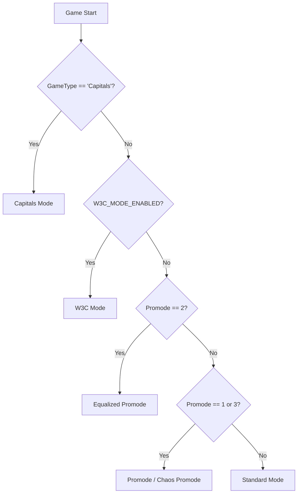
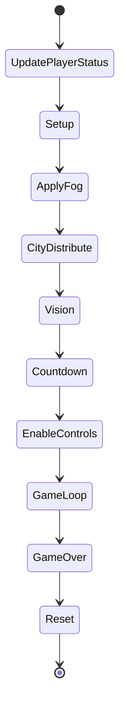
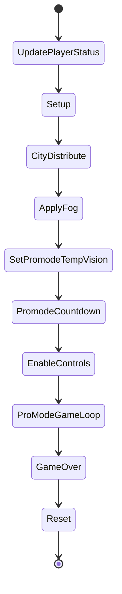
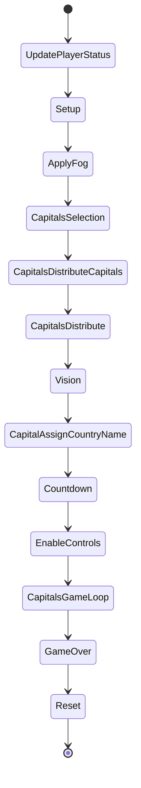
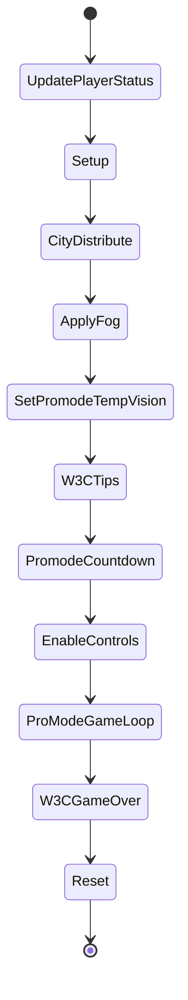
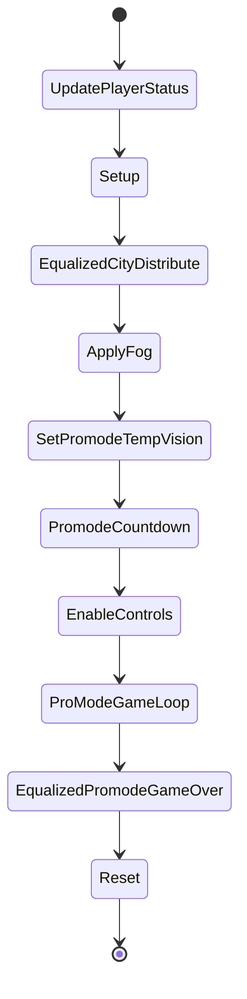
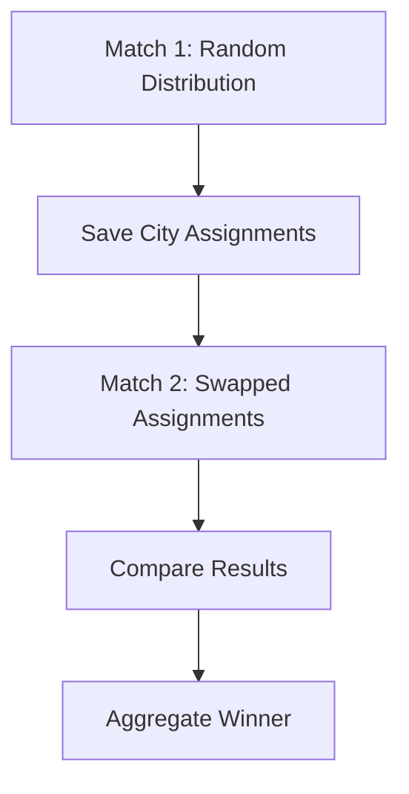

# 🎮 Game Modes

> WC3 Risk supports five distinct game modes, each with its own setup flow, state sequence, and gameplay rules. The mode is determined by lobby settings at game start.

[← Back to Wiki Home](./README.md)

---

## Table of Contents

- [Mode Selection](#mode-selection)
- [Standard Mode](#standard-mode)
- [Promode](#promode)
- [Capitals Mode](#capitals-mode)
- [W3C Mode](#w3c-mode)
- [Equalized Promode](#equalized-promode)
- [Mode Comparison](#mode-comparison)

---

## Mode Selection

The game mode is chosen based on lobby settings with the following priority:

### Promode Setting Values

| Value | Mode |
|-------|------|
| `0` | Off (Standard) |
| `1` | Promode |
| `2` | Equalized Promode |
| `3` | Chaos Promode |

---

## Standard Mode

The default game mode. Cities are randomly distributed, fog of war is applied, and players compete in a free-for-all to control 60% of the map.

### State Sequence

| # | State | Description |
|---|-------|-------------|
| 1 | **UpdatePlayerStatus** | Detect active/leaving players, assign statuses |
| 2 | **Setup** | Initialize map, create countries, build cities |
| 3 | **ApplyFog** | Apply fog of war based on lobby setting |
| 4 | **CityDistribute** | Randomly assign cities to players (max 22/player) |
| 5 | **Vision** | Grant vision based on owned cities |
| 6 | **Countdown** | 10-second countdown before game starts |
| 7 | **EnableControls** | Unlock player commands and unit control |
| 8 | **GameLoop** | Main gameplay — 60-second turns with income/spawning |
| 9 | **GameOver** | Display results, calculate ratings |
| 10 | **Reset** | Clean up for potential restart |

### Key Rules
- Random city distribution with country balance constraints
- Fog of war applied per lobby setting (Off / On / Night cycle)
- Standard 60-second turns
- Starting income: **4 gold/turn**
- Win condition: **60% of total cities**

---

## Promode

A competitive mode with modified setup — cities are distributed before fog is applied, and temporary vision is granted during a planning phase.

### State Sequence

| # | State | Description |
|---|-------|-------------|
| 1 | **UpdatePlayerStatus** | Detect active/leaving players |
| 2 | **Setup** | Initialize map |
| 3 | **CityDistribute** | Distribute cities *before* fog (players see initial layout) |
| 4 | **ApplyFog** | Apply fog of war |
| 5 | **SetPromodeTempVision** | Grant temporary full-map vision for planning |
| 6 | **PromodeCountdown** | Extended countdown with vision |
| 7 | **EnableControls** | Unlock controls |
| 8 | **ProModeGameLoop** | Competitive game loop |
| 9 | **GameOver** | Results and ratings |
| 10 | **Reset** | Cleanup |

### Key Differences from Standard
- Cities visible before fog is applied (strategic planning)
- Temporary vision phase lets players scout the full map
- Fog → distribute order is reversed compared to Standard

### Chaos Promode (Promode Setting = 3)
- Same state sequence as Promode
- **Starting income: 25 gold/turn** instead of 4
- Faster-paced gameplay with more resources

---

## Capitals Mode

Players choose a capital city, then cities are distributed outward from each capital. Countries are renamed after their capital's owner.

### State Sequence

| # | State | Description |
|---|-------|-------------|
| 1 | **UpdatePlayerStatus** | Detect active/leaving players |
| 2 | **Setup** | Initialize map |
| 3 | **ApplyFog** | Apply fog |
| 4 | **CapitalsSelection** | 30-second phase — players pick a capital city |
| 5 | **CapitalsDistributeCapitals** | Assign chosen capitals to players |
| 6 | **CapitalsDistribute** | Distribute remaining cities outward from capitals |
| 7 | **Vision** | Grant vision |
| 8 | **CapitalAssignCountryName** | Rename countries to match capital owner |
| 9 | **Countdown** | 10-second countdown |
| 10 | **EnableControls** | Unlock controls |
| 11 | **CapitalsGameLoop** | Main gameplay loop |
| 12 | **GameOver** | Results |
| 13 | **Reset** | Cleanup |

### Capitals Selection Phase
- **Duration:** 30 seconds
- Players click on a city to select as their capital
- Capital cities use special building models (`CAPITAL` / `CONQUERED_CAPITAL`)
- Unselected players get a random capital

---

## W3C Mode

A competitive mode designed for the W3Champions matchmaking platform with automatic game termination and draw voting.

### State Sequence

### W3C-Specific Features

| Feature | Detail |
|---------|--------|
| **Auto-terminate** | Game ends if only 1 human player remains (`W3C_TERMINATE_IF_ALONE_HUMAN_PLAYER`) |
| **Draw Vote** | `-w3c-draw` command starts a 120-second draw vote |
| **GG Command** | `-w3c-gg` command for concession |
| **Tips Display** | W3CTips state shows competitive tips before game starts |
| **Promode base** | Uses Promode distribution and game loop |

---

## Equalized Promode

A two-match competitive format. Match 1 plays normally; Match 2 uses the exact same city distribution but swapped between players — ensuring fair comparison.

### State Sequence

### Two-Match System

- **Match 1:** Random city allocation (same as Promode)
- **Match 2:** Same cities, swapped between players
- Ensures neither player has a geographic advantage over both matches
- Designed for head-to-head competitive fairness

---

## Mode Comparison

| Feature | Standard | Promode | Chaos | Capitals | W3C | Equalized |
|---------|----------|---------|-------|----------|-----|-----------|
| Starting Income | 4 | 4 | 25 | 4 | 4 | 4 |
| Fog Before Distribute | ✅ | ❌ | ❌ | ✅ | ❌ | ❌ |
| Temp Vision Phase | ❌ | ✅ | ✅ | ❌ | ✅ | ✅ |
| Capital Selection | ❌ | ❌ | ❌ | ✅ (30s) | ❌ | ❌ |
| Country Renaming | ❌ | ❌ | ❌ | ✅ | ❌ | ❌ |
| Draw Vote | ❌ | ❌ | ❌ | ❌ | ✅ | ❌ |
| Auto-terminate Solo | ❌ | ❌ | ❌ | ❌ | ✅ | ❌ |
| Two-Match System | ❌ | ❌ | ❌ | ❌ | ❌ | ✅ |
| State Count | 10 | 10 | 10 | 13 | 11 | 10 |

---

## Source Code Reference

| File | Purpose |
|------|---------|
| `src/app/utils/game-mode-logic.ts` | Pure mode selection logic |
| `src/app/game/game-mode/mode/` | Mode class implementations |
| `src/app/game/game-mode/standard-game-mode/` | Standard state implementations |
| `src/app/game/game-mode/promode-game-mode/` | Promode state implementations |
| `src/app/game/game-mode/capital-game-mode/` | Capitals state implementations |
| `src/app/game/game-mode/w3c-game-mode/` | W3C state implementations |
| `src/configs/game-settings.ts` | Game settings constants |

---

[← Back to Wiki Home](./README.md) · [Game Loop & Turns →](./game-loop.md)
