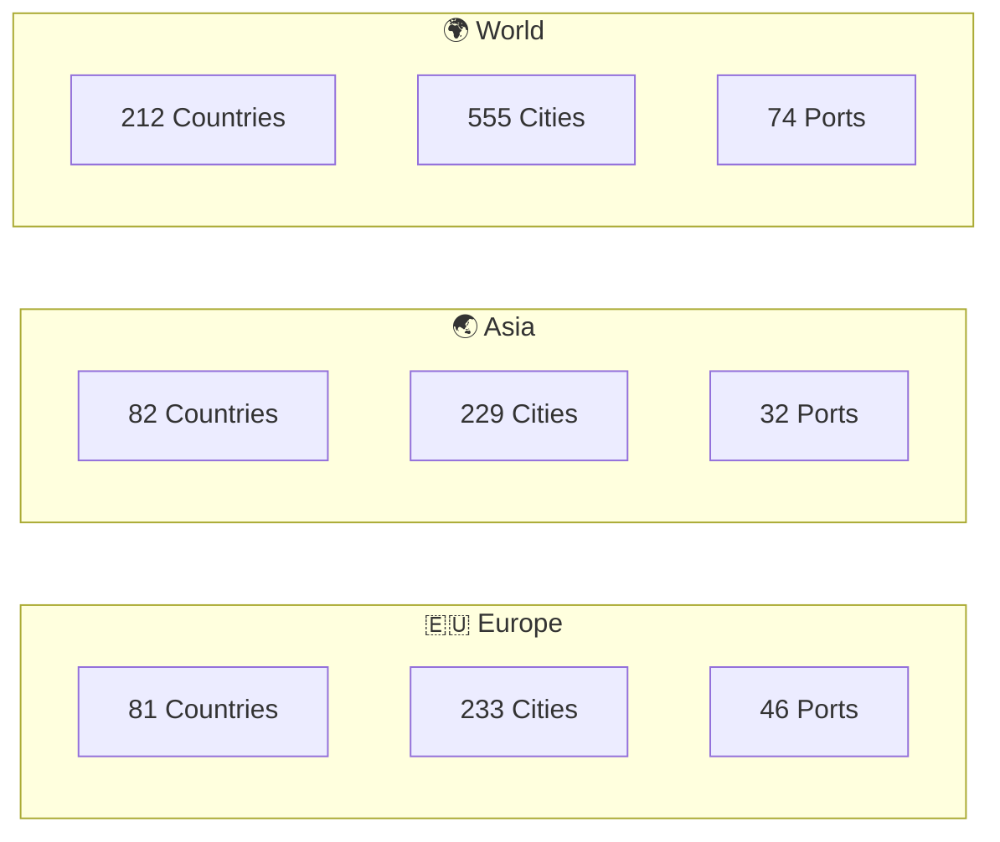
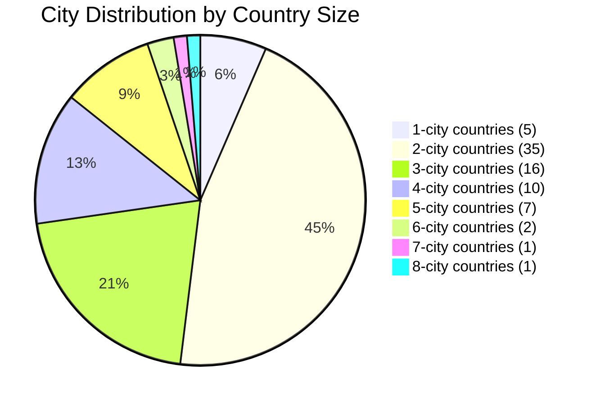
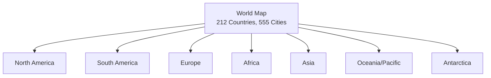
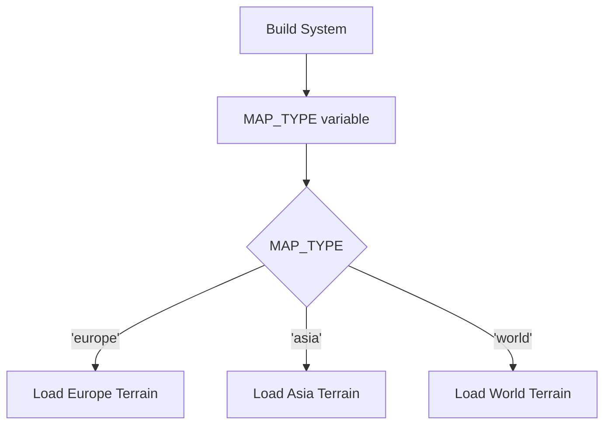

# Maps & Territories

> WC3 Risk supports three terrain maps: Europe, Asia, and World. Each map features a unique set of countries and cities with strategic variety.

[← Back to Wiki Home](./README.md)

---

## Table of Contents

- [Map Overview](#map-overview)
- [Europe](#europe)
- [Asia](#asia)
- [World](#world)
- [Map Selection](#map-selection)
- [Terrain Comparison](#terrain-comparison)

---

## Map Overview



| Map | Countries | Cities | Ports | Avg Cities/Country | Port Density |
|-----|-----------|--------|-------|--------------------|-------------|
| **Europe** | 81 | 233 | 46 | 2.9 | 19.7% |
| **Asia** | 82 | 229 | 32 | 2.8 | 14.0% |
| **World** | 212 | 555 | 74 | 2.6 | 13.3% |

---

## Europe

The Europe map covers the European continent plus North Africa, the Middle East, and Greenland. With 81 countries, it provides a dense strategic landscape.

### Country List

| Country | Cities | Ports | Country | Cities | Ports |
|---------|--------|-------|---------|--------|-------|
| Albania | 2 | 1 | Algeria | 3 | 0 |
| Arkhangelsk | 3 | 0 | Armenia | 2 | 0 |
| Austria | 3 | 0 | Azerbaijan | 2 | 0 |
| Belarus | 3 | 0 | Belgium | 2 | 1 |
| Bosnia | 2 | 0 | Bulgaria | 3 | 0 |
| Catalonia | 2 | 1 | Central Russia | 5 | 0 |
| Corsica | 1 | 1 | Crete | 2 | 2 |
| Crimea | 2 | 1 | Croatia | 2 | 0 |
| Cyprus | 2 | 2 | Czechia | 2 | 0 |
| Denmark | 3 | 1 | Disko Bay | 2 | 1 |
| East Greenland | 2 | 1 | Egypt | 4 | 0 |
| England | 3 | 1 | Estonia | 2 | 1 |
| Finland | 5 | 1 | France | 8 | 2 |
| Georgia | 2 | 0 | Germany | 6 | 0 |
| Greece | 3 | 1 | Hungary | 3 | 0 |
| Iceland | 2 | 2 | Iraq | 4 | 0 |
| Ireland | 3 | 2 | Isle of Man | 1 | 0 |
| Israel | 2 | 1 | Jordan | 2 | 0 |
| Kaliningrad | 1 | 1 | Karelia | 3 | 1 |
| Latvia | 2 | 1 | Lebanon | 1 | 0 |
| Leningrad | 3 | 1 | Lithuania | 2 | 0 |
| Lybia | 4 | 1 | Macedonia | 2 | 0 |
| Malta | 1 | 1 | Moldova | 2 | 0 |
| Montenegro | 2 | 0 | Morocco | 4 | 0 |
| Moscow | 2 | 0 | National Park | 2 | 0 |
| Netherlands | 2 | 1 | Normandy | 2 | 1 |
| North Russia | 5 | 0 | Northern Italy | 4 | 1 |
| Norway | 4 | 2 | Novaya | 2 | 1 |
| Palestine | 2 | 0 | Poland | 4 | 0 |
| Portugal | 2 | 1 | Romania | 4 | 0 |
| Sami | 2 | 0 | Sardinia | 1 | 1 |
| Scotland | 2 | 1 | Serbia | 2 | 0 |
| Siberia | 3 | 0 | Sicily | 2 | 1 |
| Slovakia | 2 | 0 | Slovenia | 2 | 0 |
| Southern Italy | 3 | 0 | Southern Russia | 5 | 1 |
| Spain | 4 | 0 | Svalbard | 2 | 1 |
| Sweden | 5 | 1 | Switzerland | 2 | 0 |
| Syria | 3 | 0 | Tunisia | 2 | 1 |
| Türkiye | 7 | 2 | Ukraine | 6 | 0 |
| Volga | 4 | 0 | Wales | 2 | 0 |
| West Greenland | 2 | 0 | | | |

### Europe Map Statistics



### Largest Countries (Europe)

| Rank | Country | Cities | Strategic Value |
|------|---------|--------|-----------------|
| 1 | France | 8 | Highest income bonus, hardest to hold |
| 2 | Türkiye | 7 | Controls Europe-Asia bridge |
| 3 | Germany | 6 | Central position, high bonus |
| 4 | Ukraine | 6 | Eastern front control |
| 5 | Finland | 5 | Northern position |
| 5 | Sweden | 5 | Scandinavian control |
| 5 | Central Russia | 5 | Deep eastern territory |
| 5 | North Russia | 5 | Arctic access |
| 5 | Southern Russia | 5 | Caucasus region |

---

## Asia

The Asia map covers the Asian continent plus parts of East Africa and Oceania. With 82 countries, it provides a vast strategic theater.

### Key Statistics

- **82 countries**, **229 cities**, **32 ports** (14% port density)
- More land-focused than Europe with fewer naval opportunities
- Large countries in central Asia provide significant income bonuses

### Notable Countries (Asia)

| Country | Cities | Notes |
|---------|--------|-------|
| East Kazakhstan | 8 | Largest country, highest bonus |
| Central China | 6 | Strategic heartland |
| Southern India | 6 | Peninsula control |
| Tanzania | 6 | East African presence |
| Wuhan | 5 | Central Chinese region |
| Saudi Arabia | 5 | Middle East anchor |

---

## World

The World map is the largest, covering all continents including Antarctica. With 212 countries and 555 cities, it provides the most expansive gameplay.

### Key Statistics

- **212 countries**, **555 cities**, **74 ports** (13.3% port density)
- Covers all 7 continents including Antarctica
- Island nations and archipelagos add naval complexity
- Games typically run longer due to more territory

### Continental Coverage



### Notable Countries (World)

| Country | Cities | Ports | Notes |
|---------|--------|-------|-------|
| Western Australia | 6 | 1 | Largest Australian region |
| Adelie Land | 5 | 1 | Antarctic territory |
| Cuba | 3 | 2 | Caribbean naval hub |
| Bermuda | 2 | 2 | Full naval territory |
| Easter Island | 2 | 2 | Remote Pacific island |
| Fiji | 2 | 2 | Pacific naval position |

---

## Map Selection

The map (terrain) is determined at build time:



Build commands:
- `npm run build europe`
- `npm run build asia`
- `npm run build world`

Launch commands:
- `npm run launch europe`
- `npm run launch asia`
- `npm run launch world`

---

## Terrain Comparison

### Gameplay Implications

| Aspect | Europe | Asia | World |
|--------|--------|------|-------|
| **Game Length** | Medium | Medium | Long |
| **Naval Focus** | High (19.7% ports) | Medium (14% ports) | Medium (13.3% ports) |
| **Cities to Win** | 140 | 138 | 333 |
| **Max Players** | Up to 24 | Up to 24 | Up to 24 |
| **Starting Cities/Player (18p)** | ~12 | ~12 | ~22 (capped) |
| **Country Variety** | Dense, many borders | Large central areas | Global diversity |

### Starting Cities Per Player

The number of starting cities depends on the player count and map:

```
maxCitiesPerPlayer = min(⌊totalCities / numPlayers⌋, 22)
```

| Players | Europe (233) | Asia (229) | World (555) |
|---------|-------------|------------|-------------|
| 8 | 22 (capped) | 22 (capped) | 22 (capped) |
| 12 | 19 | 19 | 22 (capped) |
| 16 | 14 | 14 | 22 (capped) |
| 18 | 12 | 12 | 22 (capped) |
| 20 | 11 | 11 | 22 (capped) |
| 24 | 9 | 9 | 22 (capped) |

---

## Source Code Reference

| File | Purpose |
|------|---------|
| `src/configs/terrains/europe.ts` | Europe terrain configuration |
| `src/configs/terrains/asia.ts` | Asia terrain configuration |
| `src/configs/terrains/world.ts` | World terrain configuration |
| `src/configs/city-country-setup.ts` | Dynamic terrain loader |
| `src/configs/region-setup.ts` | Region bonus definitions |

---

[← Victory & Elimination](./victory.md) · [Back to Wiki Home](./README.md) · [Cities & Countries →](./cities-countries.md)

