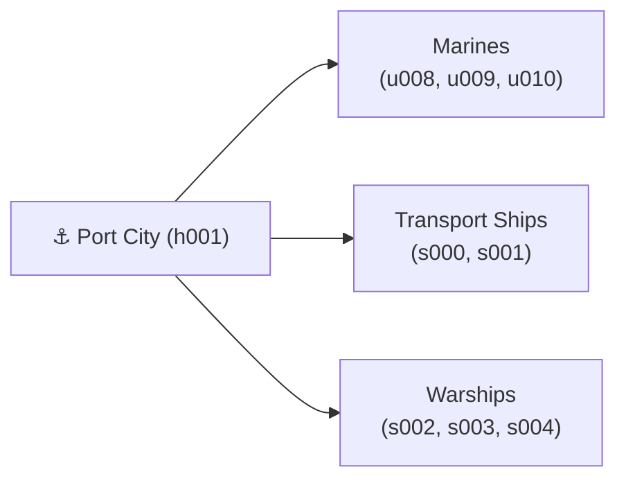
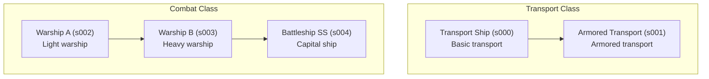
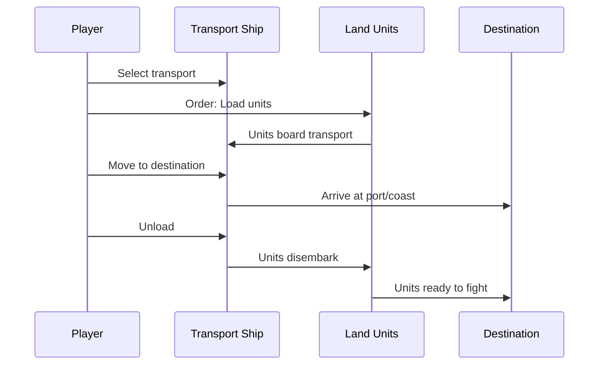
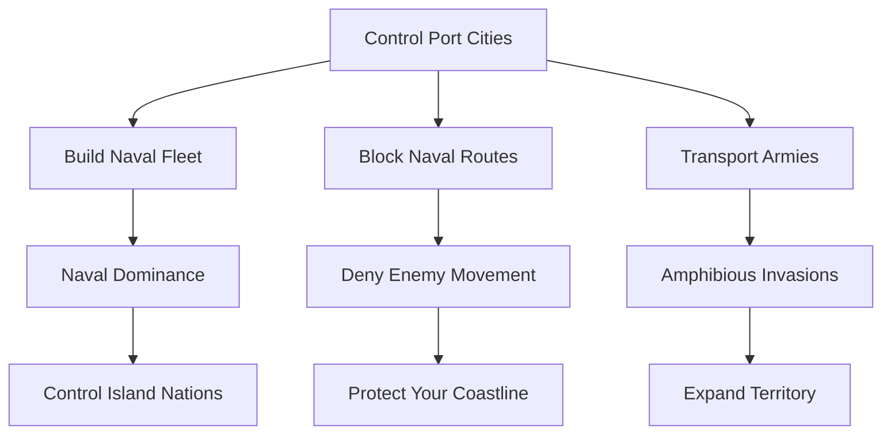

# 🌊 Naval System

> Ports and ships add a maritime dimension to WC3 Risk. Control port cities to build fleets, transport armies across water, and dominate naval chokepoints.

[← Back to Wiki Home](./README.md)

---

## Table of Contents

- [Port Cities](#port-cities)
- [Naval Units](#naval-units)
- [Ships](#ships)
- [Transport System](#transport-system)
- [Naval Strategy](#naval-strategy)

---

## Port Cities

Port cities are coastal territories that train naval units and ships instead of land units.

### Port Distribution

| Map | Total Cities | Port Cities | Port Percentage |
|-----|-------------|------------|-----------------|
| Europe | 233 | 46 | 19.7% |
| Asia | 229 | 32 | 14.0% |
| World | 555 | 74 | 13.3% |

### Notable Port Countries (Europe)

Some countries are fully naval (all cities are ports):

| Country | Cities | Ports | Naval Control |
|---------|--------|-------|---------------|
| Crete | 2 | 2 | 100% naval |
| Cyprus | 2 | 2 | 100% naval |
| Iceland | 2 | 2 | 100% naval |
| Corsica | 1 | 1 | 100% naval |
| Malta | 1 | 1 | 100% naval |
| Sardinia | 1 | 1 | 100% naval |
| Kaliningrad | 1 | 1 | 100% naval |

---

## Naval Units

Naval infantry units are trained at port cities and fight on water.

| Unit | ID | Tier | Role |
|------|----|------|------|
| **Marine** | `u008` | Basic | Entry-level naval unit |
| **Major** | `u009` | Mid | Experienced naval combatant |
| **Admiral** | `u010` | Elite | Top-tier naval commander |

Naval units function similarly to land units but operate on water terrain.

---

## Ships

Ships are vessel units with unique naval capabilities.

| Ship | ID | Type | Key Feature |
|------|----|------|-------------|
| **Transport Ship** | `s000` | Transport | Carries land units across water |
| **Armored Transport** | `s001` | Transport | Tougher transport with more cargo |
| **Warship A** | `s002` | Combat | Naval combat vessel |
| **Warship B** | `s003` | Combat | Advanced naval combat |
| **Battleship SS** | `s004` | Capital | Strongest naval unit in the game |

### Ship Hierarchy

---

## Transport System

Transport ships allow moving land armies across water — a critical strategic capability.

### Transport Abilities

| Ability | ID | Description |
|---------|----|-------------|
| **Cargo Hold** | `a009` | Determines transport capacity |
| **Load** | `a010` | Manually load nearby land units |
| **Unload** | `a011` | Unload carried units at destination |
| **Autoload On** | `a013` | Automatically load nearby units |
| **Autoload Off** | `a014` | Disable automatic loading |
| **Transport Patrol** | `A008` | Set up automatic patrol route |

### Transport Flow

### Autoload

With **Autoload On**, transport ships automatically pick up nearby land units:
- Useful for quickly loading armies
- Toggle off to prevent accidental loading
- Controlled via `a013` (on) and `a014` (off) abilities

### Patrol Routes

**Transport Patrol** (`A008`) allows setting automatic patrol routes:
- Ship moves between two points automatically
- Useful for continuous reinforcement across water
- Can be combined with autoload for automated supply lines

---

## Naval Strategy

### Why Ports Matter

### Key Naval Chokepoints (Europe)

| Route | Ports Involved | Strategic Value |
|-------|---------------|-----------------|
| North Sea | Norway, Scotland, Denmark | Controls Scandinavian access |
| Mediterranean | France, Northern Italy, Sicily, Sardinia | Central sea control |
| Baltic Sea | Sweden, Finland, Estonia, Latvia | Northern European waterway |
| English Channel | England, Normandy, Belgium | Cross-channel movement |
| Aegean Sea | Greece, Crete, Türkiye | Eastern Mediterranean |
| Black Sea | Crimea, Southern Russia, Türkiye | Eastern European naval zone |

### Tips

1. **Control nearby ports first** — They're your only naval production
2. **Use transports for surprise attacks** — Land armies can cross water with escort
3. **Patrol routes for automation** — Set up transport patrols for continuous reinforcement
4. **Island nations are defensible** — Malta, Iceland, Crete are easier to hold
5. **Mixed fleets are strongest** — Combine warships (combat) with transports (movement)

---

## Source Code Reference

| File | Purpose |
|------|---------|
| `src/configs/unit-id.ts` | Ship and naval unit IDs |
| `src/configs/ability-id.ts` | Transport abilities |
| `src/app/city/types/port-city.ts` | Port city implementation |
| `src/app/triggers/unit_death/` | Naval unit death handling |

---

[← Cities & Countries](./cities-countries.md) · [Back to Wiki Home](./README.md) · [Rating & Ranked →](./rating.md)
