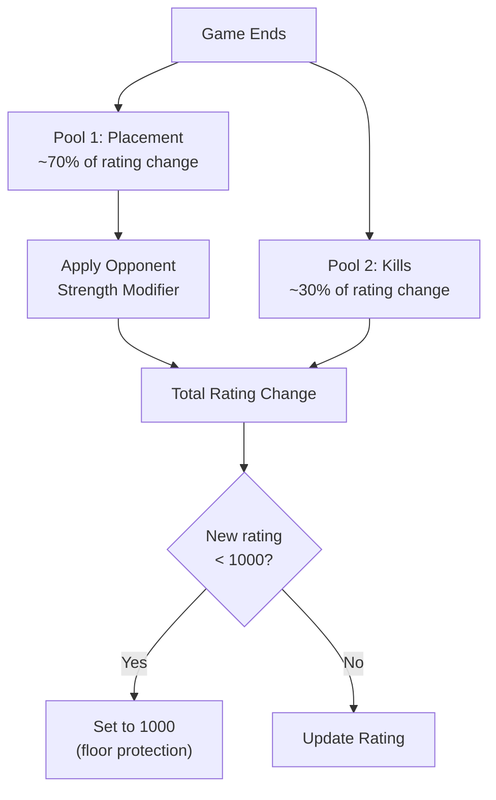
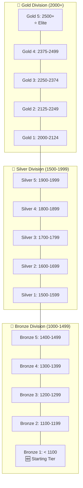
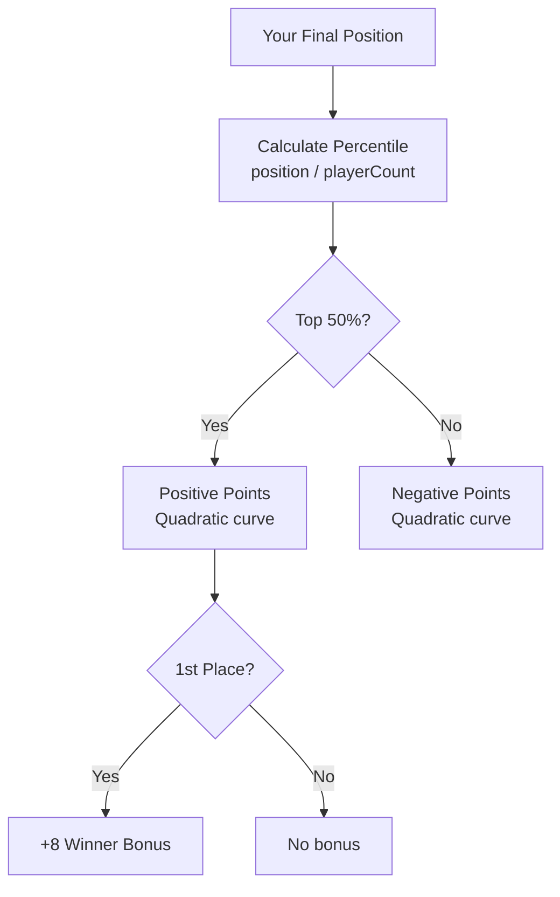
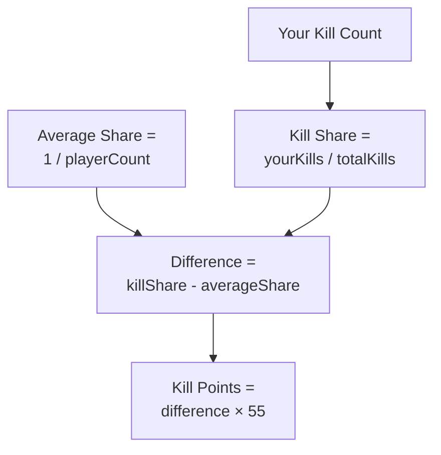
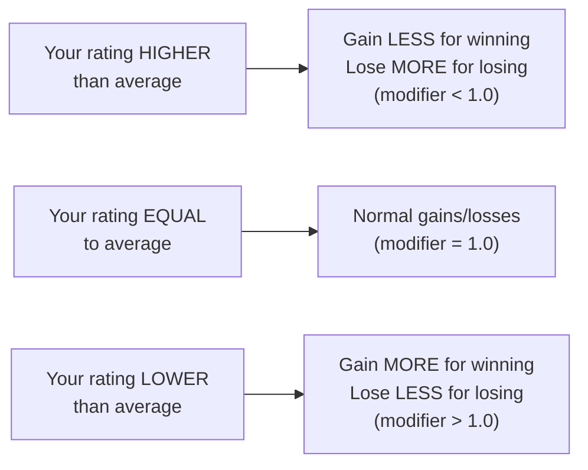

```mermaid
flowchart TD
    Position["Finish Position"] --> PlaceCalc["Calculate<br/>Placement Points"]
    Rating["My Rating vs<br/>Average Rating"] --> OppMod["Calculate Opponent<br/>Strength Modifier"]
    PlaceCalc --> Apply["Placement × Modifier"]
    OppMod --> Apply
    Kills["My Kills vs<br/>Total Kills"] --> KillCalc["Calculate<br/>Kill Points"]
    Apply --> Total["Total Rating Change"]
    KillCalc --> Total
    Total --> Floor{"Rating < 1000?"}
    Floor -- Yes --> Set1000["Set to 1000"]
    Floor -- No --> NewRating["New Rating"]
```

# Rating & Ranked System

> WC3 Risk features a comprehensive ELO-style rating system with 15 rank tiers across Bronze, Silver, and Gold. Ratings are calculated using a two-pool zero-sum system that rewards both placement and combat contribution.

[← Back to Wiki Home](./README.md)

---

## Table of Contents

- [Overview](#overview)
- [Ranked Requirements](#ranked-requirements)
- [Rank Tiers](#rank-tiers)
- [Rating Calculation](#rating-calculation)
- [Placement Pool](#placement-pool)
- [Kill Pool](#kill-pool)
- [Opponent Strength Modifier](#opponent-strength-modifier)
- [Complete Formula](#complete-formula)
- [Examples](#examples)
- [Rating Storage](#rating-storage)

---

## Overview

The rating system measures player skill through a **two-pool zero-sum** formula:



---

## Ranked Requirements

| Requirement | Value | Description |
|-------------|-------|-------------|
| Minimum Players | **16** | Must have 16+ human players |
| Game Type | **FFA only** | Team games are unranked |
| Starting Rating | **1000** | Initial rating for new players |
| Floor Protection | **1000** | Cannot drop below starting rating |
| Season ID | **1** | Current ranked season |
| Season Reset Key | `'live'` | Season reset identifier |

---

## Rank Tiers

The system features **15 tiers** across three divisions:



### Tier Ranges

| Division | Tier | Rating Range | Points Per Tier |
|----------|------|-------------|-----------------|
| 🥉 Bronze | 1 | < 1100 | — (starting) |
| 🥉 Bronze | 2 | 1100-1199 | 100 |
| 🥉 Bronze | 3 | 1200-1299 | 100 |
| 🥉 Bronze | 4 | 1300-1399 | 100 |
| 🥉 Bronze | 5 | 1400-1499 | 100 |
| 🥈 Silver | 1 | 1500-1599 | 100 |
| 🥈 Silver | 2 | 1600-1699 | 100 |
| 🥈 Silver | 3 | 1700-1799 | 100 |
| 🥈 Silver | 4 | 1800-1899 | 100 |
| 🥈 Silver | 5 | 1900-1999 | 100 |
| 🥇 Gold | 1 | 2000-2124 | 125 |
| 🥇 Gold | 2 | 2125-2249 | 125 |
| 🥇 Gold | 3 | 2250-2374 | 125 |
| 🥇 Gold | 4 | 2375-2499 | 125 |
| 🥇 Gold | 5 | 2500+ | — (uncapped) |

> **Note:** Gold tiers use 125-point intervals (wider than Silver/Bronze's 100-point tiers), making progression harder at the top.

---

## Rating Calculation

### Constants

| Constant | Value | Description |
|----------|-------|-------------|
| `MAX_WIN_POINTS` | 15 | Maximum points for 1st place (raw) |
| `MAX_LOSS_POINTS` | 15 | Maximum penalty for last place (raw) |
| `WINNER_BONUS` | 8 | Extra bonus for 1st place only |
| `BREAKEVEN_PERCENTILE` | 0.50 | Top 50% gain, bottom 50% lose |
| `OPPONENT_STRENGTH_FACTOR` | 0.32 | Rating difference modifier (0.68× to 1.32×) |
| `KILL_POOL_MULTIPLIER` | 55 | Kill contribution scaling factor |
| `TARGET_INFLATION_PER_GAME` | 0 | True zero-sum (no inflation) |

---

## Placement Pool

The placement pool contributes ~70% of rating change and is based on your finishing position.

### How It Works



### Formula

**Top 50% (Winners):**
```
points = MAX_WIN_POINTS × (1 - (placement / breakeven)²) + WINNER_BONUS[if 1st]
```

**Bottom 50% (Losers):**
```
points = -MAX_LOSS_POINTS × ((placement - breakeven) / lossZoneSize)²
```

### Placement Points Table (18-Player Game)

| Position | Percentile | Raw Points | With Winner Bonus |
|----------|-----------|------------|-------------------|
| 1st | 0.056 | +14.95 | **+22.95** |
| 2nd | 0.111 | +14.81 | +14.81 |
| 3rd | 0.167 | +14.53 | +14.53 |
| 4th | 0.222 | +14.07 | +14.07 |
| 5th | 0.278 | +13.37 | +13.37 |
| 6th | 0.333 | +12.33 | +12.33 |
| 7th | 0.389 | +10.93 | +10.93 |
| 8th | 0.444 | +9.07 | +9.07 |
| 9th | 0.500 | +6.67 | +6.67 |
| 10th | 0.556 | -0.38 | -0.38 |
| 11th | 0.611 | -1.50 | -1.50 |
| 12th | 0.667 | -3.38 | -3.38 |
| 13th | 0.722 | -6.00 | -6.00 |
| 14th | 0.778 | -9.38 | -9.38 |
| 15th | 0.833 | -11.00 | -11.00 |
| 16th | 0.889 | -13.38 | -13.38 |
| 17th | 0.944 | -14.81 | -14.81 |
| 18th | 1.000 | -15.00 | -15.00 |

---

## Kill Pool

The kill pool rewards combat contribution and contributes ~30% of rating change.

### Formula

```
killShare = playerKills / totalKills
averageShare = 1 / playerCount
killPoints = (killShare - averageShare) × KILL_POOL_MULTIPLIER
```

### How It Works



### Expected Kill Points (18-Player Game)

| Kill Performance | Kill Share | vs Average (0.056) | Points |
|-----------------|-----------|---------------------|--------|
| **Top killer** (15% of kills) | 0.150 | +0.094 | **+5.2** to **+10** |
| **Above average** (8% of kills) | 0.080 | +0.024 | **+1.3** |
| **Average** (5.6% of kills) | 0.056 | 0.000 | **0** |
| **Below average** (3% of kills) | 0.030 | -0.026 | **-1.4** |
| **Zero kills** | 0.000 | -0.056 | **-3.1** |

> **No caps** — Kill points scale proportionally. A dominant combat player can earn +8 to +10 points from kills alone.

---

## Opponent Strength Modifier

The placement pool is adjusted based on the average rating of your opponents.

### Formula

```
modifier = 1.0 + (playerRating - avgOpponentRating) / 400 × OPPONENT_STRENGTH_FACTOR
modifier = clamp(modifier, 0.68, 1.32)
```

### Effect



### Modifier Examples

| Your Rating | Avg Opponent | Difference | Modifier |
|-------------|-------------|------------|----------|
| 1000 | 1000 | 0 | 1.00× |
| 1200 | 1000 | +200 | 0.84× |
| 1000 | 1200 | -200 | 1.16× |
| 1500 | 1000 | +500 | 0.68× (min) |
| 1000 | 1500 | -500 | 1.32× (max) |

---

## Complete Formula

### Full Rating Change Calculation

```
ratingChange = (placementPoints × opponentModifier) + killPoints

Where:
  placementPoints = f(position, playerCount, isWinner)
  opponentModifier = clamp(1.0 + (myRating - avgRating) / 400 × 0.32, 0.68, 1.32)
  killPoints = (myKillShare - avgKillShare) × 55

Floor protection:
  newRating = max(1000, currentRating + ratingChange)
```



---

## Examples

### Example 1: Strong Win

```
Player: Silver 3 (1750 rating)
Game: 18 players, average rating 1500
Position: 1st place
Kills: 15% of total

Placement: +14.95 + 8.0 (winner bonus) = +22.95
Opponent Modifier: 1.0 + (1750-1500)/400 × 0.32 = 0.80×
Adjusted Placement: 22.95 × 0.80 = +18.36
Kill Points: (0.15 - 0.056) × 55 = +5.17
─────────────────────────────────────
Total: +18.36 + 5.17 = +23.53 rating
New Rating: 1750 + 24 = 1774 (still Silver 3)
```

### Example 2: Average Loss

```
Player: Bronze 3 (1250 rating)
Game: 18 players, average rating 1400
Position: 12th place
Kills: 3% of total

Placement: -3.38
Opponent Modifier: 1.0 + (1250-1400)/400 × 0.32 = 1.12×
Adjusted Placement: -3.38 × 1.12 = -3.79
Kill Points: (0.03 - 0.056) × 55 = -1.43
─────────────────────────────────────
Total: -3.79 + (-1.43) = -5.22 rating
New Rating: 1250 - 5 = 1245 (still Bronze 3)
```

### Example 3: Last Place but Good Combat

```
Player: Silver 1 (1550 rating)
Game: 18 players, average rating 1500
Position: 18th place (last)
Kills: 20% of total (aggressive player)

Placement: -15.00
Opponent Modifier: 1.0 + (1550-1500)/400 × 0.32 = 0.96×
Adjusted Placement: -15.00 × 0.96 = -14.40
Kill Points: (0.20 - 0.056) × 55 = +7.92
─────────────────────────────────────
Total: -14.40 + 7.92 = -6.48 rating
New Rating: 1550 - 6 = 1544 (still Silver 1)
Note: Kill contribution significantly reduced the loss!
```

### Example 4: Floor Protection

```
Player: Bronze 1 (1005 rating)
Game: 18 players
Position: 18th place
Kills: 0%

Placement: -15.00
Kill Points: -3.08
Total: -18.08
Raw New Rating: 1005 - 18 = 987
─────────────────────────────────────
Floor Protection Applied: New Rating = 1000 (minimum)
```

---

## Rating Storage

### Per-Player File Structure

Each player's rating is stored in a file keyed by their BattleTag:

| Field | Description |
|-------|-------------|
| Version | File format version |
| Season ID | Current ranked season |
| Checksum | Tamper detection |
| Rating | Current ELO rating |
| Games Played | Total ranked games |
| Wins | Total wins |
| Losses | Total losses |
| Kill Value | Accumulated kill stats |
| Death Value | Accumulated death stats |
| Pending Game | Crash recovery data |

### Crash Recovery

- Preliminary ratings are saved at the end of each turn
- If the game crashes mid-match, pending game data allows recovery
- Final ratings are calculated and saved at game over

### Sync & Display

| Setting | Value | Description |
|---------|-------|-------------|
| `RATING_SYNC_TIMEOUT` | 10.0s | Timeout for rating sync operations |
| `RATING_SYNC_TOP_PLAYERS` | 100 | Number of top players to sync |

---

## Source Code Reference

| File | Purpose |
|------|---------|
| `src/app/rating/rating-calculator.ts` | Core rating calculation formula |
| `src/app/rating/` | Rating system implementation |
| `src/configs/game-settings.ts` | Rating constants and settings |
| `tests/rating-calculator.test.ts` | 38 rating calculation tests |

---

[← Naval System](./naval.md) · [Back to Wiki Home](./README.md) · [Diplomacy & Teams →](./diplomacy.md)

