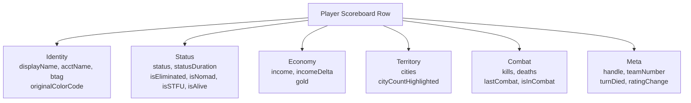
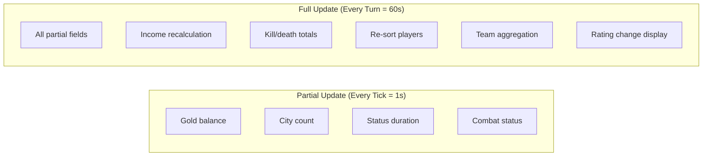
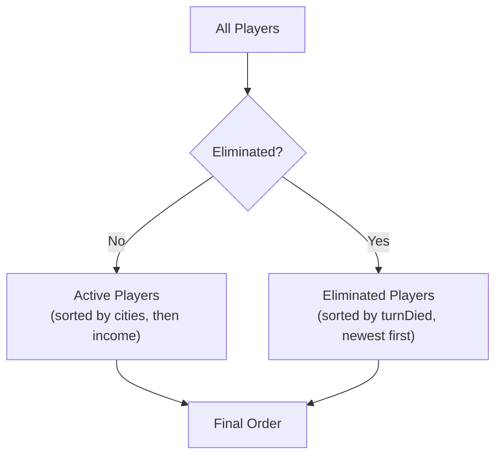
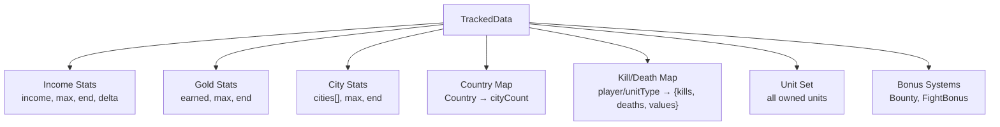
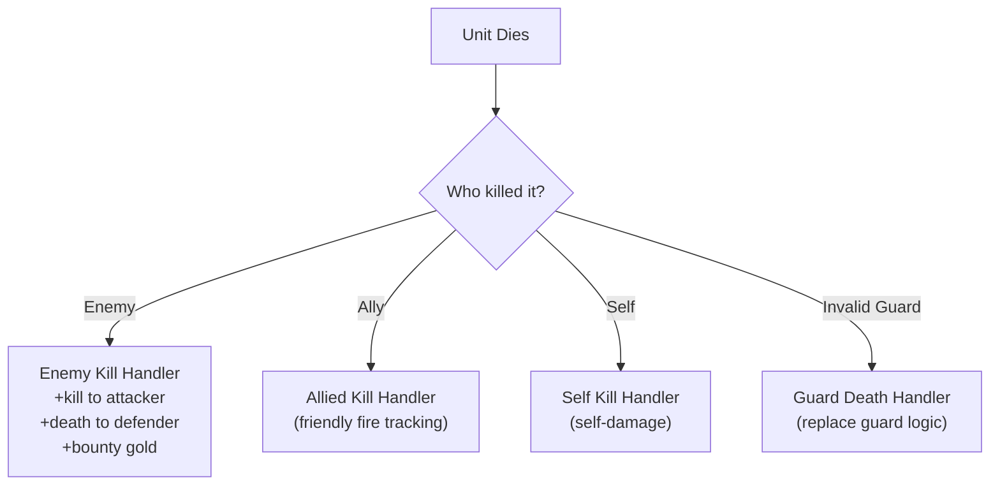
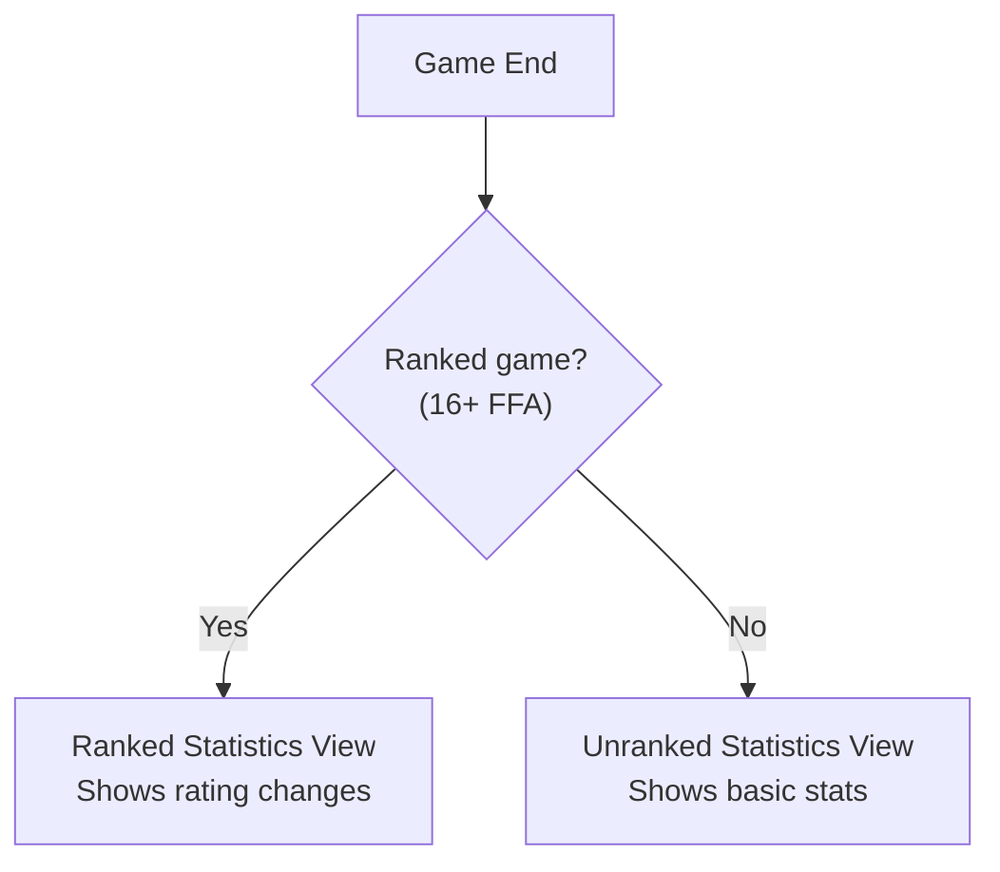

# Scoreboard & Statistics

> WC3 Risk features a real-time scoreboard that tracks player performance and a statistics system for post-game analysis. This page covers scoreboard mechanics, sorting, and stat tracking.

[← Back to Wiki Home](./README.md)

---

## Table of Contents

- [Scoreboard Overview](#scoreboard-overview)
- [Player Row Data](#player-row-data)
- [Team Row Data](#team-row-data)
- [Update Frequency](#update-frequency)
- [Sorting Rules](#sorting-rules)
- [Statistics Tracking](#statistics-tracking)
- [Kill/Death Tracking](#killdeath-tracking)
- [W3MMD Integration](#w3mmd-integration)
- [Rating Stats UI](#rating-stats-ui)

---

## Scoreboard Overview

The scoreboard displays real-time game information for all players:

```
╔══════════════════════════════════════════════════════════════════╗
║  #  │ Player     │ Status │ Income │ Gold │ Cities │ K │ D     ║
╠══════════════════════════════════════════════════════════════════╣
║  1  │ Player A   │ Alive  │   12   │  45  │   28   │ 5 │ 2    ║
║  2  │ Player B   │ Alive  │    9   │  32  │   22   │ 3 │ 1    ║
║  3  │ Player C   │ Alive  │    6   │  18  │   15   │ 2 │ 3    ║
║  4  │ Player D   │ Nomad  │    4   │   8  │    0   │ 1 │ 4    ║
║  5  │ Player E   │ Dead   │    1   │   3  │    0   │ 0 │ 5    ║
║  6  │ Player F   │ Left   │    0   │   0  │    0   │ 0 │ 2    ║
╚══════════════════════════════════════════════════════════════════╝
```

---

## Player Row Data

Each player row tracks the following data:



### Complete Field List

| Field | Type | Description |
|-------|------|-------------|
| `player` | Player | WC3 player object |
| `handle` | handle | WC3 handle reference |
| `displayName` | string | Player's display name |
| `acctName` | string | Account name |
| `btag` | string | BattleTag |
| `originalColorCode` | string | Player color code |
| `income` | number | Current income per turn |
| `incomeDelta` | number | Income change from last turn |
| `gold` | number | Current gold balance |
| `cities` | number | Number of cities owned |
| `cityCountHighlighted` | boolean | Whether city count is highlighted (near win) |
| `kills` | number | Total enemy units killed |
| `deaths` | number | Total own units lost |
| `status` | string | Current status (Alive/Nomad/Dead/Left/STFU) |
| `statusDuration` | number | Seconds remaining in current status |
| `isEliminated` | boolean | Whether player is eliminated |
| `isNomad` | boolean | Whether player is in Nomad state |
| `isSTFU` | boolean | Whether player is muted |
| `isAlive` | boolean | Whether player is alive |
| `turnDied` | number | Turn number when player was eliminated |
| `lastCombat` | number | Timestamp of last combat |
| `isInCombat` | boolean | Whether player is currently in combat |
| `teamNumber` | number | Team assignment number |
| `ratingChange` | number | Rating change (shown at game end) |

---

## Team Row Data

In team modes, aggregate team rows are also displayed:

| Field | Type | Description |
|-------|------|-------------|
| `team` | Team | Team object |
| `number` | number | Team number |
| `totalIncome` | number | Sum of all members' income |
| `totalCities` | number | Sum of all members' cities |
| `totalKills` | number | Sum of all members' kills |
| `totalDeaths` | number | Sum of all members' deaths |
| `members` | Player[] | Array of team member players |
| `isEliminated` | boolean | Whether entire team is eliminated |

---

## Update Frequency

The scoreboard updates at two different frequencies:



| Update Type | Frequency | When |
|-------------|-----------|------|
| `updatePartial()` | Every tick (1s) | During game loop |
| `updateFull()` | Every turn (60s) | At turn end |

---

## Sorting Rules

The scoreboard sorts players using a specific priority system:



### Sort Priority

1. **Non-eliminated players first** (sorted by status/performance)
2. **Eliminated players after** (sorted by turn they died, most recent first)

### Within Active Players

| Priority | Criteria | Direction |
|----------|----------|-----------|
| 1 | City count | Descending |
| 2 | Income | Descending |

### Within Eliminated Players

| Priority | Criteria | Direction |
|----------|----------|-----------|
| 1 | Turn died | Descending (newest first) |

---

## Statistics Tracking

### Tracked Data Per Player

The game tracks comprehensive statistics through the `TrackedData` structure:



### Income Tracking

| Metric | Description |
|--------|-------------|
| `income` | Current income per turn |
| `max` | Highest income ever achieved |
| `end` | Final income at game end |
| `delta` | Income change this turn |

### Gold Tracking

| Metric | Description |
|--------|-------------|
| `earned` | Total gold earned (only positive amounts) |
| `max` | Highest gold balance ever held |
| `end` | Final gold balance at game end |

### City Tracking

| Metric | Description |
|--------|-------------|
| `cities` | Array of currently owned cities |
| `max` | Maximum cities ever held simultaneously |
| `end` | Final city count at game end |

---

## Kill/Death Tracking

The game tracks kills and deaths with granular detail:

### Per-Player K/D

| Metric | Description |
|--------|-------------|
| `kills` | Number of units killed belonging to each opponent |
| `deaths` | Number of own units killed by each opponent |
| `killValue` | Total value of units killed (weighted by unit cost) |
| `deathValue` | Total value of units lost |

### Per-Unit-Type K/D

| Metric | Description |
|--------|-------------|
| Per `TRACKED_UNITS` entry | Kills and deaths broken down by unit type |

### Death Event Processing



---

## W3MMD Integration

WC3 Risk supports **W3MMD** (Warcraft 3 Map Meta Data) for stats reporting to external platforms.

| Setting | Value | Description |
|---------|-------|-------------|
| `MMD_ENABLED` | true | Enable W3MMD stats reporting |

### Exported Data Options

| Setting | Default | Description |
|---------|---------|-------------|
| `ENABLE_EXPORT_SHUFFLED_PLAYER_LIST` | false | Export randomized player order |
| `ENABLE_EXPORT_GAME_SETTINGS` | false | Export game configuration |
| `ENABLE_EXPORT_END_GAME_SCORE` | false | Export final scores |

---

## Rating Stats UI

A dedicated UI panel shows detailed rating information, accessible via **F4** or the stats button.

### What It Shows

| Data | Description |
|------|-------------|
| Current Rating | Player's ELO rating |
| Rank Tier | Bronze/Silver/Gold with tier number |
| Games Played | Total ranked games |
| Win/Loss | Win-loss record |
| K/D Ratio | Kill-death ratio |
| Rating Change | Projected/actual rating change for current game |

### Access Methods

| Method | Description |
|--------|-------------|
| **F4 Key** | Toggle rating stats panel |
| **UI Button** | Click the rating stats button |

### Availability

- Only shown when `RATING_SYSTEM_ENABLED = true`
- Updates at the end of each turn
- Shows real-time projected rating change during gameplay

---

## Statistics Views

Two different views are available depending on game mode:



| View | Content |
|------|---------|
| **Ranked** | Full stats + rating change + tier progression |
| **Unranked** | Basic stats (kills, deaths, cities, income) |

---

## Source Code Reference

| File | Purpose |
|------|---------|
| `src/app/scoreboard/` | Scoreboard implementation |
| `src/app/utils/scoreboard-sort-logic.ts` | Pure sorting logic |
| `src/app/player/data/tracked-data.ts` | TrackedData structure |
| `src/app/statistics/` | Statistics system |
| `src/app/statistics/statistics-model.ts` | Stats data model |
| `src/app/statistics/ranked-statistics-view.ts` | Ranked stats view |
| `src/app/statistics/unranked-statistics-view.ts` | Unranked stats view |
| `src/app/statistics/replay-manager.ts` | Replay recording |
| `src/app/triggers/unit_death/` | Kill/death event handlers |

---

[← Advanced Mechanics](./advanced.md) · [Back to Wiki Home](./README.md)

