# ⚔️ Units & Combat

> WC3 Risk features a diverse roster of land and naval units, each with unique stats and roles. This page covers all unit types, the spawning system, guard mechanics, and combat abilities.

[← Back to Wiki Home](./README.md)

---

## Table of Contents

- [Unit Overview](#unit-overview)
- [Land Units](#land-units)
- [Naval Units](#naval-units)
- [Ships](#ships)
- [Structures](#structures)
- [Spawning System](#spawning-system)
- [Guard System](#guard-system)
- [Unit Abilities](#unit-abilities)
- [Elimination Debuff](#elimination-debuff)
- [Unit Comparison & Priority](#unit-comparison--priority)
- [Player Tools](#player-tools)

---

## Unit Overview

Units in WC3 Risk are divided into three categories:

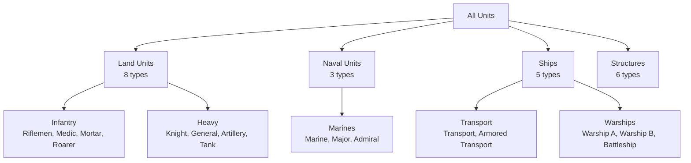

---

## Land Units

Land units are trained at land cities (barracks). They form the backbone of your army.

| | Unit | ID | HP | Damage | Role | Cost Tier |
|---|------|----|----|--------|------|-----------|
|  | **Riflemen** | `u000` | 200 | 20 | Basic ranged infantry | Low |
| 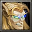 | **Medic** | `u001` | 250 | 9 | Healer support | Low |
|  | **Mortar** | `u002` | 350 | 25 | Siege/AoE damage | Medium |
| 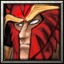 | **Roarer** | `u003` | 425 | 31 | Buff/support (Roar ability) | Medium |
| 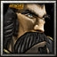 | **Knight** | `u004` | 900 | 43 | Heavy melee cavalry | High |
| 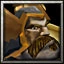 | **General** | `u005` | 1300 | 62 | Elite command unit | High |
| 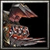 | **Artillery** | `u006` | 1000 | 62 | Long-range siege | High |
| 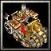 | **Tank** | `u007` | 2600 | 64 | Strongest land unit | Highest |

> **Note:** HP and damage values are sourced from `assets/icons/unitStats.ts`.

### Unit Details

| | Unit | Description |
|---|------|-------------|
| 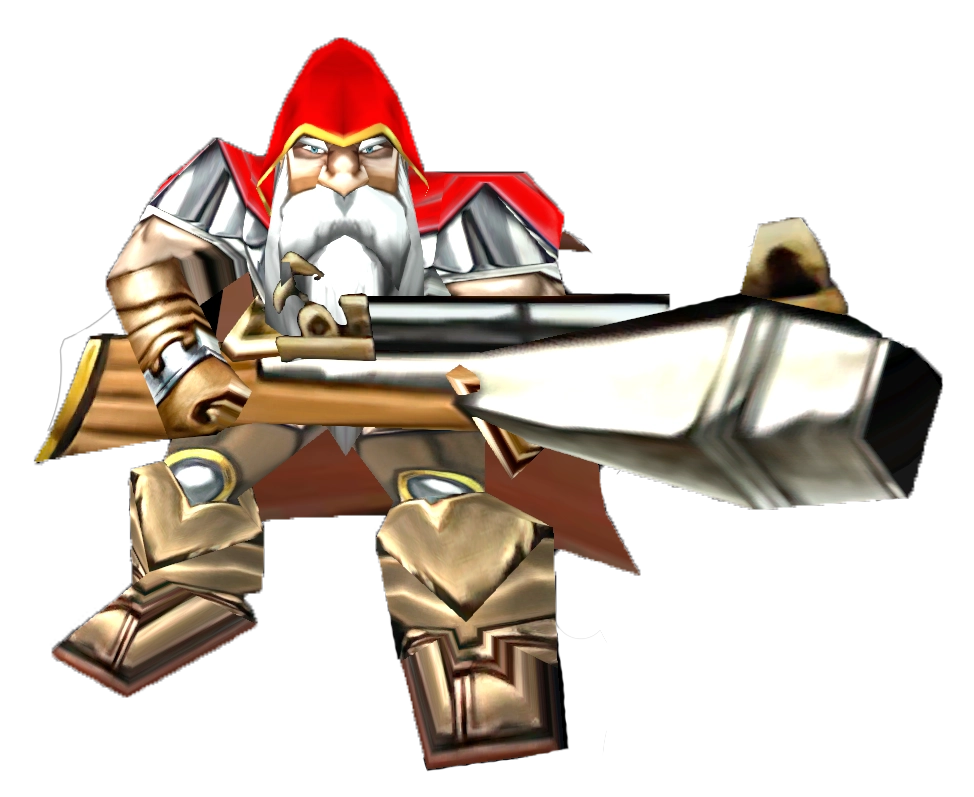 | **Riflemen** | Basic attack force, best used in large numbers. High ranged DPS and long attack range, scales well in numbers. Vulnerable to fast or diving units. |
| 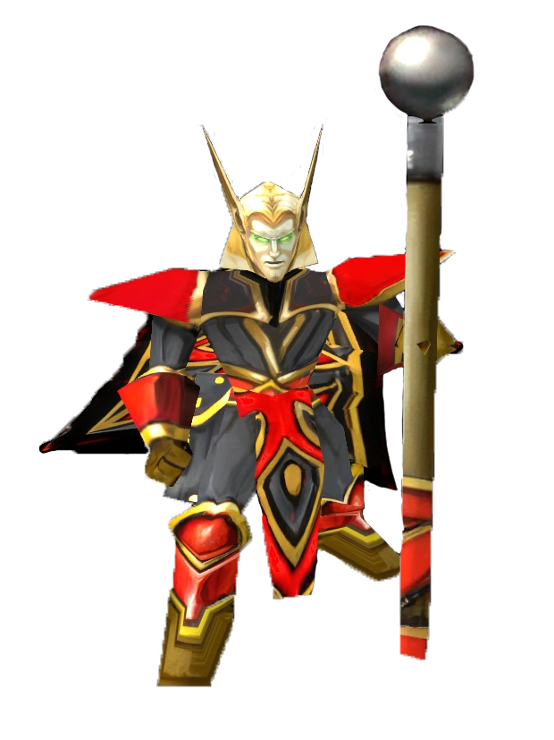 | **Medic** | Support unit with Heal ability. Great force multiplier in drawn-out fights. No offensive capability, relies on protection. |
| 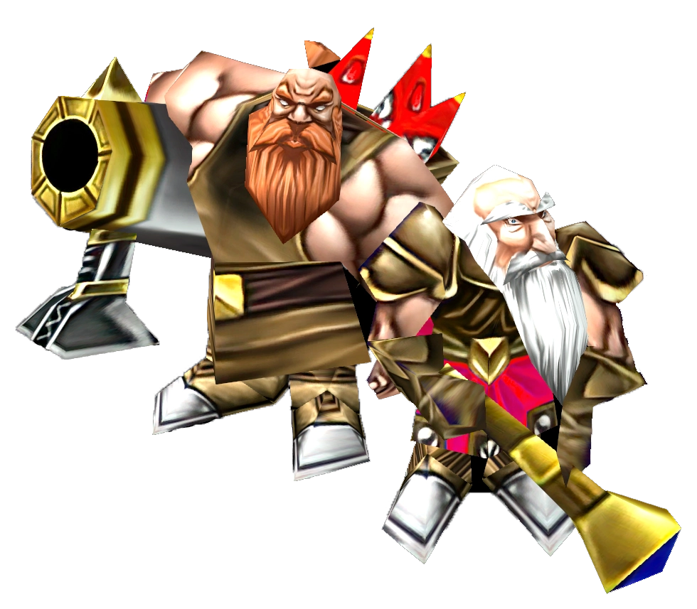 | **Mortar** | Siege unit with long range and splash damage. Can attack the ground and target trees. Slow and vulnerable if caught out. |
| 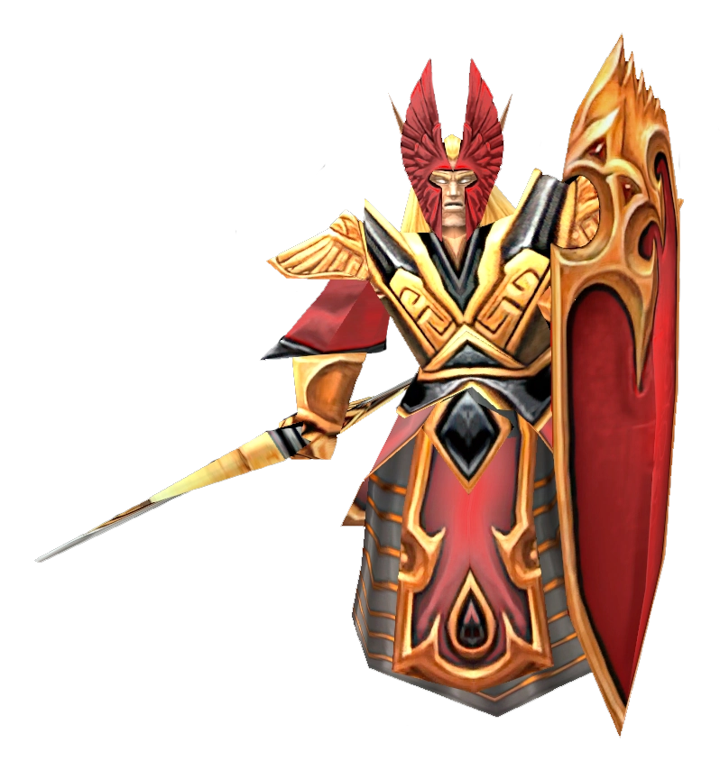 | **Roarer** | Magic unit with Roar (damage buff) and Dispel Magic. Valuable support in battles. Requires careful positioning. |
| 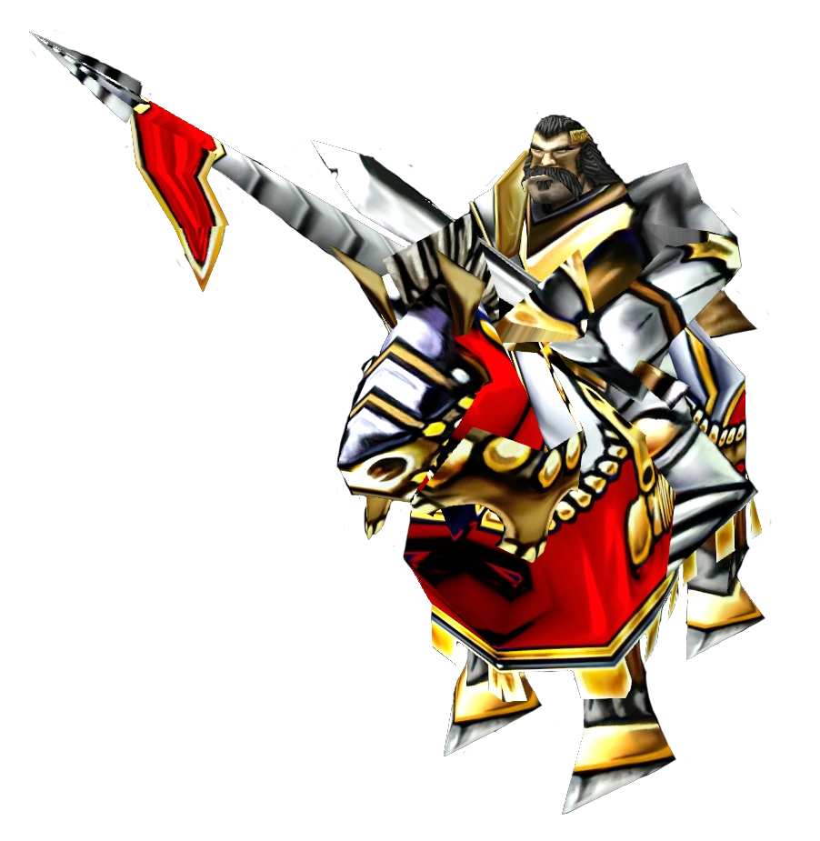 | **Knight** | Melee unit with Frenzy ability (attack + movement speed). Powerful for quick engagements. Vulnerable to ranged units. |
| 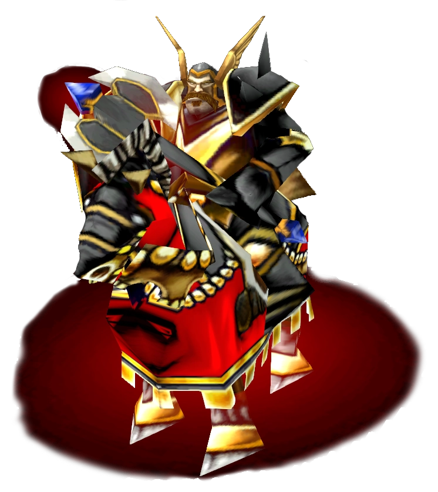 | **General** | Elite melee unit with Roar and Frenzy. Enhances nearby units while dealing high damage. Costly but strong. |
| 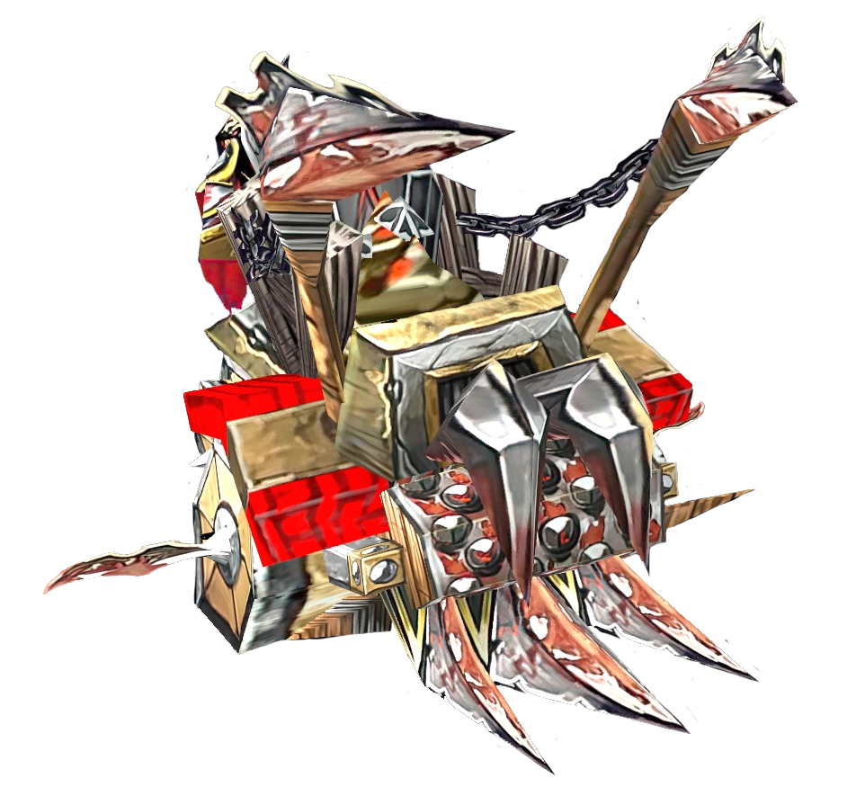 | **Artillery** | Very long range siege with 170-range splash damage. Can attack ground and trees. Defensively weak, needs protection. |
| 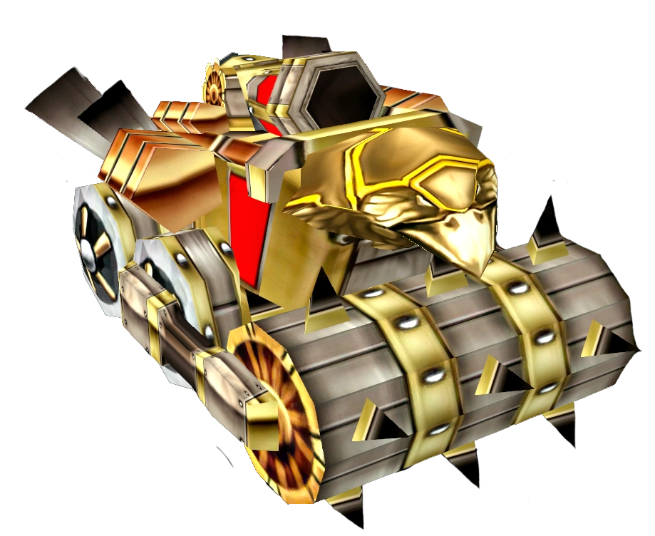 | **Tank** | High-cost durable siege unit with regeneration. 500 range, 90-range splash. Cannot attack trees. Best used in mass. |

### Unit Progression

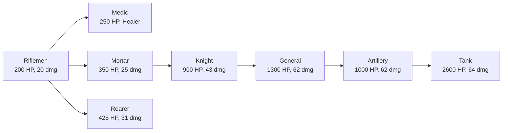

---

## Naval Units

Naval units are trained at port cities and fight on water.

| | Unit | ID | HP | Damage | Role |
|---|------|----|-----|--------|------|
| 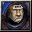 | **Marine** | `u008` | 215 | 14 | Basic naval infantry |
| 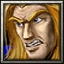 | **Major** | `u009` | 900 | 48 | Mid-tier naval unit |
| 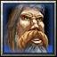 | **Admiral** | `u010` | 900 | 48 | Elite naval commander |

---

## Ships

Ships provide naval power and transport capabilities.

| | Ship | ID | HP | Damage | Role |
|---|------|----|-----|--------|------|
| 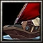 | **Transport Ship** | `s000` | 300 | 0 | Carries land units across water |
| 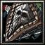 | **Armored Transport** | `s001` | 800 | 0 | Tougher transport ship |
| 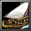 | **Warship A** | `s002` | 550 | 38 | Combat vessel |
| 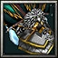 | **Warship B** | `s003` | 2000 | 98 | Advanced combat vessel |
| 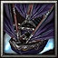 | **Battleship SS** | `s004` | 5000 | 138 | Capital ship, strongest naval unit |

### Transport Mechanics

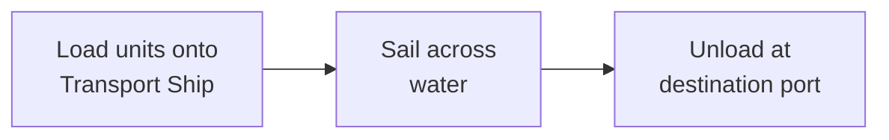

Transport ships have special abilities:
- **Cargo Hold** — Stores land units
- **Load/Unload** — Manual loading and unloading
- **Autoload On/Off** — Toggle automatic unit loading
- **Transport Patrol** — Automatic patrol routes

---

## Structures

Structures are buildings placed on the map that define gameplay zones.

| | Structure | ID | HP | Description |
|---|-----------|----|----|-------------|
| 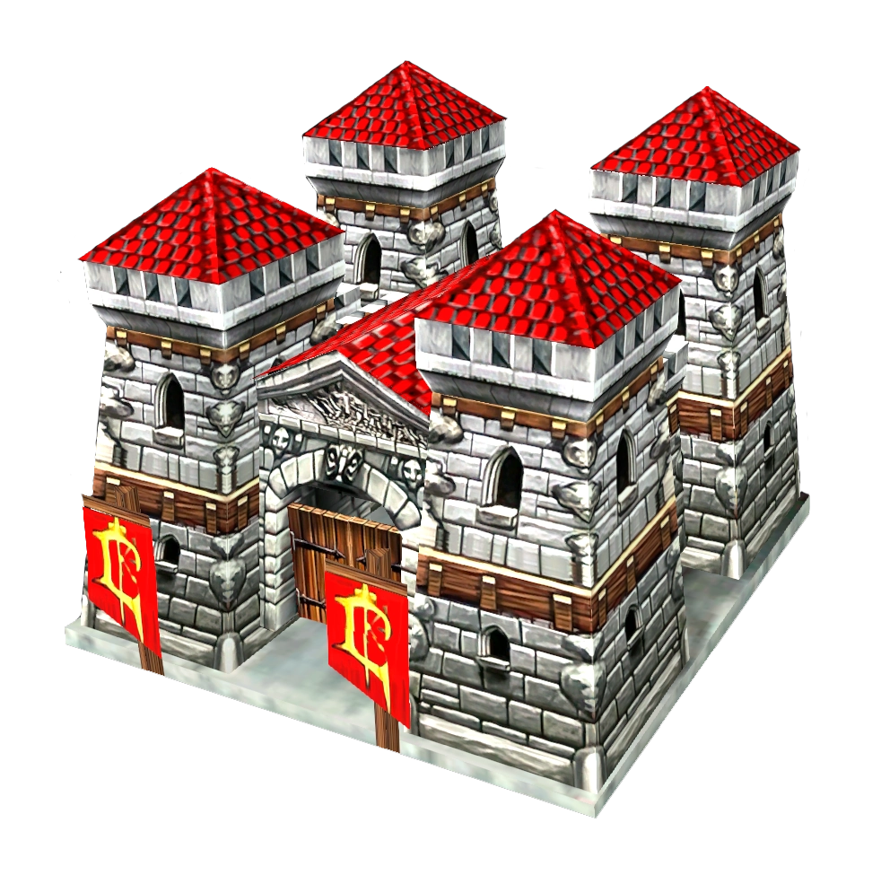 | **City** | `h000` | 1,500 | Land city / barracks — trains land units |
| 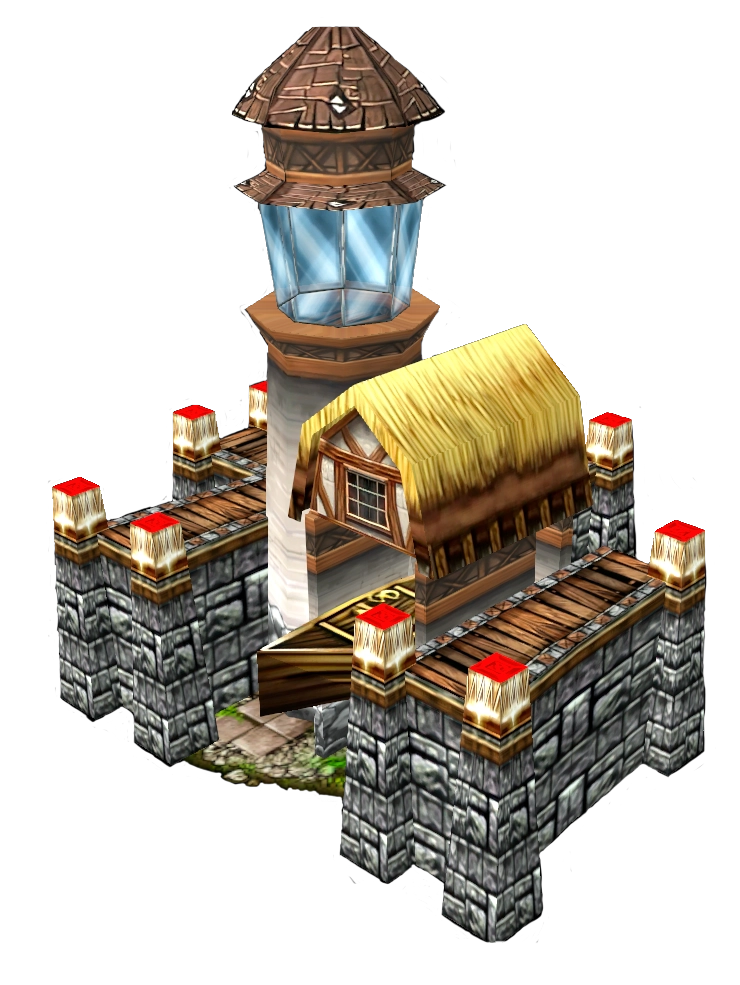 | **Port** | `h001` | — | Port city — trains naval units and ships |
| **Control Point** | `h002` | — | Territory control marker |
| **Spawner** | `h004` | — | Country spawner — generates free units |
| **Capital** | `h005` | — | Capital city (Capitals mode) |
| **Conquered Capital** | `h006` | — | Captured capital (Capitals mode) |

---

## Spawning System

Each country has a spawner that automatically generates free units for the country's owner.

### How Spawning Works

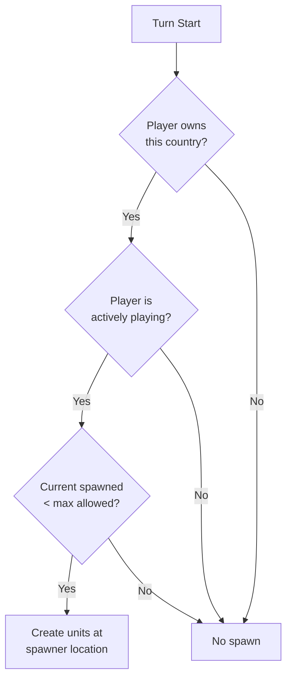

### Spawn Rules

| Parameter | Value | Description |
|-----------|-------|-------------|
| `SpawnTurnLimit` | 5 | Maximum turns a spawner produces units |
| Default spawn type | Riflemen | All spawners produce Riflemen by default |
| Spawn opacity | 75% | Spawned units appear slightly transparent (RGBA: 200,200,200,150) |

### Spawn Capacity

```
maxSpawnsPerPlayer = spawnsPerStep × SpawnTurnLimit
spawnThisTurn = min(spawnsPerStep, maxSpawns - currentCount)
```

### Spawn Multiplier

A configurable multiplier affects spawn rates:
- **Default:** 1.0× (standard rate)
- Affects both per-turn spawn count and total maximum
- Higher multiplier = more units per turn and higher cap

---

## Guard System

Each city has a designated **guard** — a defensive unit that protects the city.

### Guard Mechanics

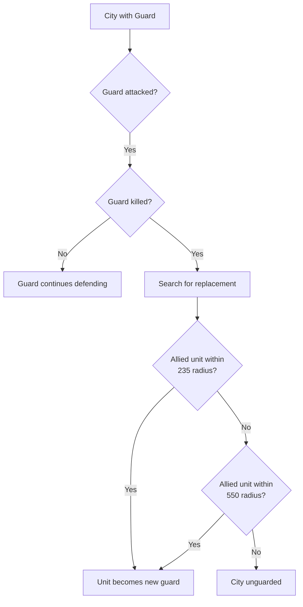

### Search Radii

| Radius | Distance | Used For |
|--------|----------|----------|
| Small | 235 units | First search for replacement near city |
| Large | 550 units | Extended search near dying guard |

### Guard Position

Guards are positioned at an offset from the city center:
- **X Offset:** 125 units
- **Y Offset:** 255 units

### Guard Selection Priority

When multiple units could become the new guard, selection is based on player preferences:

| Setting | Behavior |
|---------|----------|
| High Value Defender | Prefers higher-cost units as guards |
| Low Value Defender | Prefers cheaper units as guards |
| High Health Defender | Prefers units with more HP |
| Low Health Defender | Prefers units with less HP |

### Guard Swap Ability

Cities have a **Swap** ability (`a030`) that lets players manually exchange the current guard with another nearby unit.

### Guard Indicator

Active guards receive the **Guard Indicator** ability (`A006`), which visually marks them as the city's defender. Guards are hidden from the minimap while guarding.

---

## Unit Abilities

### Combat Abilities

| | Ability | ID | Description |
|---|--------|----|-------------|
| 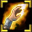 | **Heal** | `a000` | Medic healing ability |
| 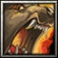 | **Roar** | `a001` | Roarer buff ability |
| 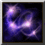 | **Dispel Magic** | `a002` | Removes buffs/debuffs |
| 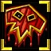 | **Frenzy** | `a003` | Attack speed boost |
|  | **Unholy Frenzy** | `a004` | Powerful attack buff |
|  | **Berserk** | `a005` | Maximum combat buff |

### Spawner Abilities

Players can interact with spawners through these abilities:

| Ability | ID | Description |
|---------|----|-------------|
| **Spawn 3000** | `a031` | Spawn units worth 3000 gold |
| **Spawn 6000** | `a032` | Spawn units worth 6000 gold |
| **Spawn All** | `a033` | Spawn maximum available |
| **Spawn Reset** | `a034` | Reset spawner state |

### Transport Abilities

| Ability | ID | Description |
|---------|----|-------------|
| **Cargo Hold** | `a009` | Storage capacity |
| **Load** | `a010` | Load units |
| **Unload** | `a011` | Unload units |
| **Autoload On** | `a013` | Enable auto-loading |
| **Autoload Off** | `a014` | Disable auto-loading |
| **Transport Patrol** | `A008` | Patrol route |

---

## Elimination Debuff

When a player is eliminated in FFA, their remaining units receive a damage-over-time debuff. Each unit type has a specific debuff ability:

| Unit | Debuff Ability ID |
|------|------------------|
| Riflemen | `A00G` |
| Medic | `A00E` |
| Mortar | `A00F` |
| Roarer | `A00H` |
| Knight | `A00J` |
| General | `A00B` |
| Artillery | `A00D` |
| Tank | `A00K` |
| Marine | `A00C` |
| Major | `A00I` |
| Warship A | `A00L` |
| Warship B | `A00M` |
| Battleship SS | `A00N` |
| Transport Ship | `A00O` |
| Armored Transport | `A00P` |

> **In team games:** Eliminated players' units are retained by teammates instead of receiving debuffs.

---

## Unit Comparison & Priority

When the game needs to select between multiple units (e.g., for guard replacement), it uses a comparison system:

### Comparison Order
1. **By Point Value** — Higher or lower value preferred (based on player setting)
2. **By Health** — If values are equal, compare by current HP (based on player setting)

### Player Settings

| Setting | Options |
|---------|---------|
| Value Priority | High Value (`a054`) or Low Value (`a053`) |
| Health Priority | High Health (`a052`) or Low Health (`a051`) |

---

## Player Tools

Each player has a **Player Tools** unit (`H000`) that provides access to guard preference abilities:

| Tool | ID | Description |
|------|----|-------------|
| Low Health Defender | `a051` | Prefer guards with low HP |
| High Health Defender | `a052` | Prefer guards with high HP |
| Low Value Defender | `a053` | Prefer cheaper guards |
| High Value Defender | `a054` | Prefer expensive guards |

---

## Source Code Reference

| File | Purpose |
|------|---------|
| `src/configs/unit-id.ts` | All unit FourCC IDs |
| `src/configs/tracked-units.ts` | Units tracked for statistics |
| `src/configs/ability-id.ts` | All ability IDs |
| `src/configs/country-settings.ts` | Spawn defaults |
| `src/app/spawner/` | Spawner implementation |
| `src/app/city/` | City and guard implementation |
| `src/app/utils/unit-comparisons.ts` | Unit comparison logic |
| `src/app/utils/guard-priority-logic.ts` | Guard selection pure logic |
| `src/app/triggers/unit_death/search-radii.ts` | Search radius constants |
| `src/app/triggers/unit_death/enemy-kill-handler.ts` | Kill handling and guard replacement |

---

[← Economy & Income](./economy.md) · [Back to Wiki Home](./README.md) · [Victory & Elimination →](./victory.md)
