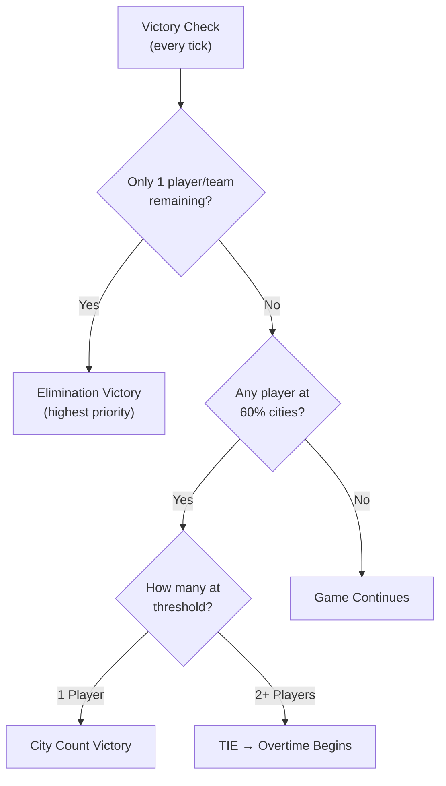
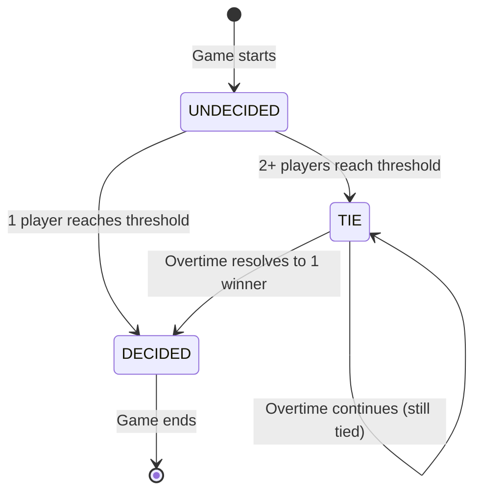
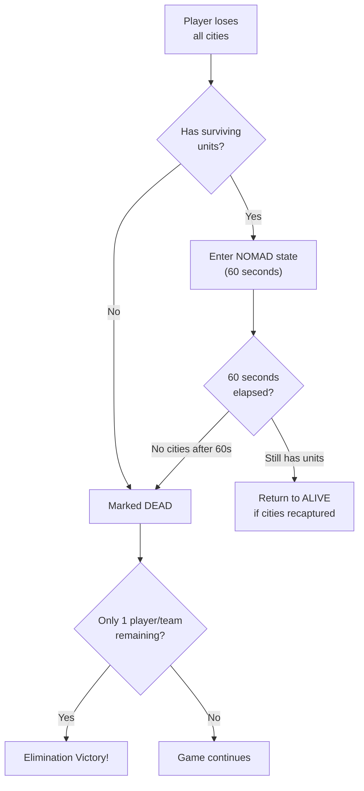
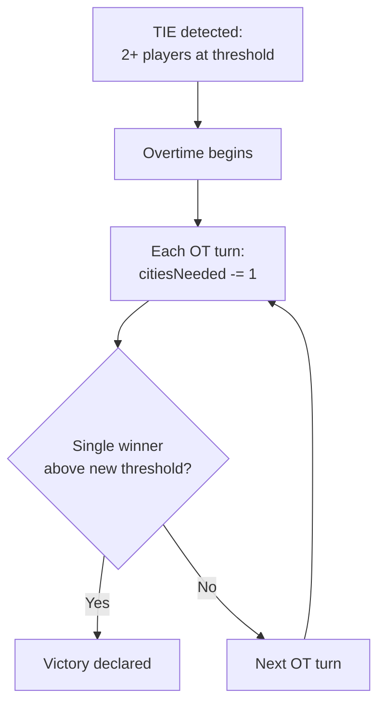
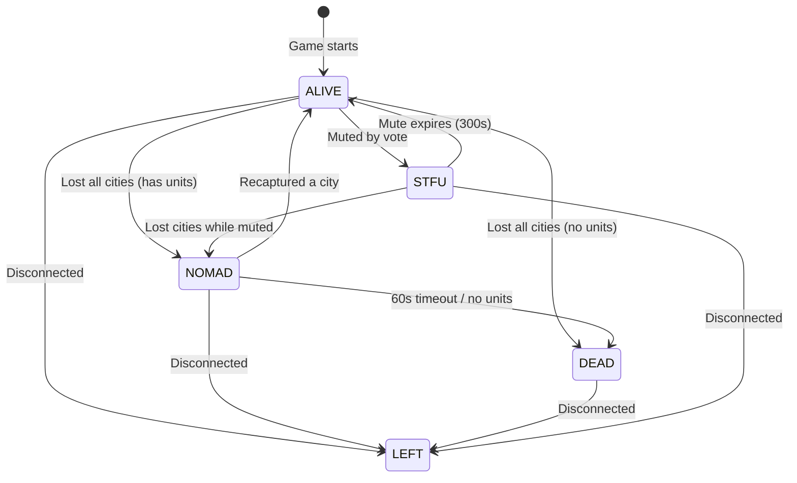
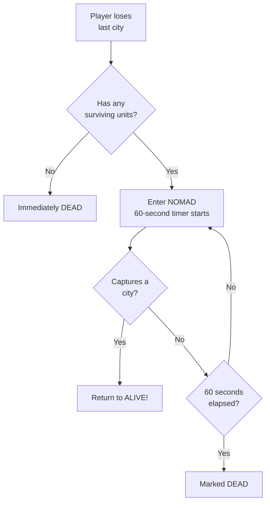
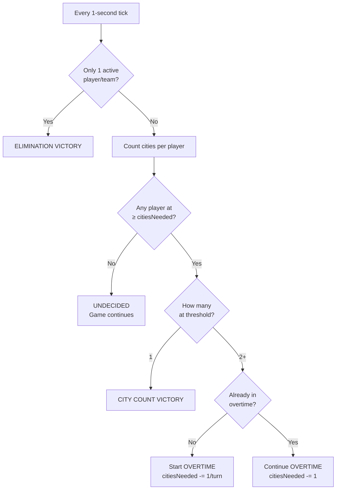

# 🏆 Victory & Elimination

> WC3 Risk games end when a player (or team) achieves dominance through city control or elimination of all opponents. This page covers win conditions, overtime mechanics, and player elimination.

[← Back to Wiki Home](./README.md)

---

## Table of Contents

- [Victory Conditions](#victory-conditions)
- [City Count Victory](#city-count-victory)
- [Elimination Victory](#elimination-victory)
- [Overtime](#overtime)
- [Player Status System](#player-status-system)
- [Nomad State](#nomad-state)
- [Victory Flow](#victory-flow)
- [Examples](#examples)

---

## Victory Conditions

There are two ways to win:



| Priority | Condition | Description |
|----------|-----------|-------------|
| 1 (highest) | **Elimination** | Only one player/team has living units |
| 2 | **City Count** | One player controls ≥60% of all cities |
| 3 | **Tie → Overtime** | Multiple players at threshold simultaneously |

---

## City Count Victory

The primary win condition — control enough cities to dominate the map.

### Formula

```
citiesNeeded = ⌈totalCities × CITIES_TO_WIN_RATIO⌉
```

### Constants

| Setting | Value | Description |
|---------|-------|-------------|
| `CITIES_TO_WIN_RATIO` | 0.60 | 60% of cities needed to win |
| `CITIES_TO_WIN_WARNING_RATIO` | 0.70 | 70% — remaining cities for warning |

### Cities Needed Per Map

| Map | Total Cities | Cities to Win (60%) | Warning at (70% remaining) |
|-----|-------------|---------------------|-----------------------------|
| **Europe** | 233 | 140 | ~163 |
| **Asia** | 229 | 138 | ~160 |
| **World** | 555 | 333 | ~389 |

### Victory State Machine



| State | Meaning |
|-------|---------|
| `UNDECIDED` | No player has reached the city threshold |
| `DECIDED` | Exactly one player meets the win condition |
| `TIE` | Two or more players tied at the threshold |

---

## Elimination Victory

If all but one player (or team) are eliminated, the last standing wins immediately — even if they don't hold 60% of cities.



---

## Overtime

When two or more players reach the city threshold simultaneously, overtime begins.

### Overtime Mechanics



### Formula

```
citiesNeeded(overtime) = max(1, ⌈totalCities × winRatio⌉ - overtimeModifier × turnsInOvertime)
```

| Parameter | Value | Description |
|-----------|-------|-------------|
| `OVERTIME_MODIFIER` | 1 | Cities subtracted per overtime turn |

### Example Overtime Progression (Europe, 233 cities)

| OT Turn | Cities Needed | Change |
|---------|--------------|--------|
| 0 (Tie detected) | 140 | — |
| 1 | 139 | -1 |
| 2 | 138 | -1 |
| 3 | 137 | -1 |
| ... | ... | ... |
| 139 | 1 | Minimum |

> Overtime gradually lowers the bar until one player has more cities than the other, preventing infinite games.

---

## Player Status System

Each player has a status that determines their capabilities:



### Status Details

| Status | Color | Income | Units | Duration |
|--------|-------|--------|-------|----------|
| 🟢 **ALIVE** | `\|cFF00FF00Alive\|r` (Green) | Full | Active | Until eliminated |
| 🟠 **NOMAD** | `\|cFFFE8A0ENmd\|r` (Orange) | 4 gold | Active (with debuff timer) | 60 seconds |
| 🔴 **DEAD** | `\|cFFFF0005Dead\|r` (Red) | 1 gold | Debuffed (FFA) / Teammate-controlled (Teams) | Permanent |
| ⬛ **LEFT** | `\|cFF65656ALeft\|r` (Gray) | 0 gold | Abandoned | Permanent |
| 🟡 **STFU** | `\|cfffe890dSTFU\|r` (Gold) | Normal | Active | 300 seconds (5 min) |

---

## Nomad State

Nomad is a grace period for players who lose all cities but still have units.

### Rules



| Parameter | Value |
|-----------|-------|
| Duration | 60 seconds |
| Income | 4 gold/turn (base only) |
| Country bonuses | None (no cities) |

> **Strategic tip:** Nomad players should immediately attempt to recapture a city. The 60-second window gives exactly one turn to mount a comeback.

---

## Victory Flow

Complete victory check flow each tick:



---

## Examples

### Example 1: Standard City Victory (Europe)

```
Map: Europe (233 cities)
Cities to win: 140

Turn 15:
  Player A: 142 cities ✅ (≥ 140)
  Player B: 55 cities
  Player C: 36 cities

→ Result: Player A wins by city count!
```

### Example 2: Elimination Victory

```
Turn 20:
  Player A: 80 cities, 50 units
  Player B: 0 cities, 3 units (NOMAD, 45s remaining)
  Player C: 0 cities, 0 units (DEAD)

Turn 21 (60 seconds later):
  Player A: 85 cities, 55 units
  Player B: 0 cities, 0 units (DEAD — nomad expired)
  Player C: DEAD

→ Result: Player A wins by elimination!
```

### Example 3: Overtime Scenario

```
Turn 30:
  Player A: 141 cities ✅
  Player B: 140 cities ✅
  → TIE detected! Overtime begins.

Overtime Turn 1 (citiesNeeded = 139):
  Player A: 143 cities ✅
  Player B: 138 cities ❌
  → Player A wins! Only one player above new threshold.
```

### Example 4: Nomad Comeback

```
Turn 12:
  Player B loses last city → enters NOMAD (60s timer)
  Player B has 8 Riflemen near an enemy city

Turn 12 (30 seconds later):
  Player B captures an unguarded city
  → Player B returns to ALIVE!
  → Nomad timer cancelled
```

---

## Source Code Reference

| File | Purpose |
|------|---------|
| `src/app/managers/victory-logic.ts` | Pure victory calculation logic |
| `src/app/managers/victory-manager.ts` | Victory state management |
| `src/app/game/game-mode/utillity/on-player-status.ts` | Player status transitions |
| `src/configs/game-settings.ts` | `CITIES_TO_WIN_RATIO`, `OVERTIME_MODIFIER`, `NOMAD_DURATION` |

---

[← Units & Combat](./units.md) · [Back to Wiki Home](./README.md) · [Maps & Territories →](./maps.md)
