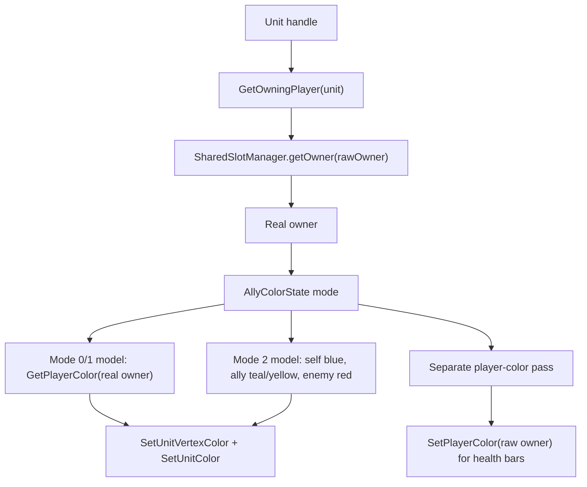

# Unit Color Assignment With Shared Slots

## Motivation

The shared-slot system spreads a player's units across multiple WC3 player handles to reduce per-player order lag. That makes raw unit ownership unreliable for visuals: a unit can be owned by slot 12 while logically belonging to player 0.

Color assignment is correct only when creation paths separate these two ideas:

- raw owner: the WC3 handle that owns and orders the unit
- real owner: the player resolved through `SharedSlotManager`
- visual color: the color applied after resolving the real owner, or after resolving the relationship to the local player in custom ally-color modes

## Current Behavior

The central color path is:



`AllyColorFilterManager.applyColorFilter(unit)` is the final model-color authority for units that are created, trained, unloaded, or converted into guards.

In normal visual modes, it resolves the real owner and applies `GetPlayerColor(realOwner)` to the unit model. Health bars are handled by the separate `AllyColorFilterManager.applyPlayerColorFilter()` pass, which resolves the raw owner slot to the real owner and syncs the physical slot with `SetPlayerColor(rawOwner, NameManager.getOriginalColor(realOwner))`. This keeps fallback colors factual even after local ally-mode overrides have changed the engine's current player colors. In custom mode 2, both passes resolve the real owner and apply local relationship colors:

| Relation to local player | Unit model color in mode 2                    | Minimap color in mode 1/2           |
| ------------------------ | --------------------------------------------- | ----------------------------------- |
| Self                     | Blue                                          | White                               |
| Ally or teammate         | Teal, or Yellow for colorblind mode           | Teal, or Yellow for colorblind mode |
| Enemy                    | Red                                           | Red                                 |
| Neutral                  | Neutral/default; high contrast can tint black | Gray/neutral texture                |

Replay viewers and observers are locked to mode 0 by `AllyColorState.getMode()`, so they see normal player colors instead of local POV relationship colors.

## Shared-Slot Color Contract

Shared slots are assigned a real owner in `SharedSlotManager.assignSlotToPlayer()`, then wired in `givePlayerFullControlOfSlot()`.

That method applies the real owner's runtime color to the shared slot:

```ts
SetPlayerColor(slot, nameManager.getOriginalColor(player));
```

Shared-slot assignment does not mutate player names. This preserves chat/statistics identity for eliminated players whose handles are reused as shared slots. Custom visual systems should not depend on raw slot color or raw slot name. The safer path is still:

```ts
const owner = SharedSlotManager.getInstance().getOwnerOfUnit(unit);
```

This matters when slots are reassigned. `SetPlayerColor(slot, ownerColor)` is updated on reassignment and refreshed by `AllyColorFilterManager.applyPlayerColorFilter()` in normal model-color modes, but `NameManager.getOriginalColor(slot)` intentionally preserves the first original color it saw for that slot. Therefore, systems that want logical unit or health-bar color should resolve to the real owner before asking for original/current player color.

## Slot Selection and Cycling Back

`SharedSlotManager.getSlotWithLowestUnitCount(player)` chooses where a new movable unit should be owned.

It always includes the actual player handle as a candidate:

```ts
let bestSlot = player;
let bestCount = this.getUnitCount(player);
```

Then it scans assigned shared slots and only switches when a shared slot has a strictly lower count.

Implications:

- If a shared slot has fewer units than the real player handle, new trained/spawned units move to that shared slot.
- If counts tie, the currently selected candidate wins. Because the real player starts as the candidate, ties cycle back to the actual player handle.
- Cycling back to the actual player is color-safe. `applyColorFilter()` resolves the owner; when raw owner is the real player, the real owner is unchanged.
- Slot choice affects order-load balancing, not logical color. Correct color depends on resolving raw owner back to real owner after slot assignment.

## Created Unit Paths

### Map setup: static city pieces

Path:

1. `ConcreteCityBuilder.setBarracks()` creates barracks for `NEUTRAL_HOSTILE`.
2. `Guard.build()` creates the initial guard for `NEUTRAL_HOSTILE`.
3. `ConcreteCityBuilder.setCOP()` creates the circle of power for `NEUTRAL_HOSTILE`.
4. `city.setOwner(NEUTRAL_HOSTILE)` applies the city-aware color filter to barracks, COP, and guard when local visibility allows it.
5. `main.ts` later calls `city.HideMinimap()`, which changes city ownership to neutral and blackens barracks/COP vertex color for fog safety.

Color notes:

- Initial static units are neutral.
- Barracks, COP, and guard get the city-aware filter during `City.setOwner()`.
- Guards get `applyColorFilter()` from `Guard.set()` when built.
- Fog/minimap code may intentionally blacken hidden city structures until seen.

Source:

- `src/app/city/concrete-city-builder.ts`
- `src/app/city/components/guard.ts`
- `src/app/city/city.ts`
- `src/main.ts`

### City distribution and capital assignment

Path:

1. Distribution calls `city.setOwner(realPlayer)`.
2. `City.setOwner()` updates the barracks and COP, then runs the city-aware color filter.
3. Distribution then calls `SetUnitOwner(city.guard.unit, realPlayer, true)`.
4. The guard is added to the real player's tracked units and the real player's slot count is incremented.
5. Distribution runs `city.refreshColorFilter()` after the guard owner update.

Color notes:

- City components go through the city-aware filter after both structure and guard ownership updates.
- Hidden, never-seen cities are left alone so their black fog camouflage is preserved.
- Hidden, previously seen cities use the last seen owner rather than the hidden current owner.

Source:

- `src/app/game/services/distribution-service/standard-distribution-service.ts`
- `src/app/game/game-mode/capital-game-mode/capitals-distribute-capitals-state.ts`
- `src/app/game/game-mode/capital-game-mode/capitals-selection-state.ts`
- `src/app/city/city.ts`

### Country spawner structures

Path:

1. `ConcreteSpawnerBuilder.setUnit()` creates the spawner structure for `NEUTRAL_HOSTILE`.
2. `Country.setOwner(realPlayer)` calls `Spawner.setOwner(realPlayer)`.
3. `Spawner.setOwner()` calls `SetUnitOwner(spawner, SharedSlotManager.getOwner(realPlayer), true)`.
4. For a real player handle, `getOwner(realPlayer)` returns the real player.

Color notes:

- Spawner structures themselves do not go through `applyColorFilter()` in `Spawner.setOwner()`.
- They are structural/country UI units, not the spawned combat units.
- Spawned combat units are handled separately and do go through the filter.

Source:

- `src/app/spawner/concrete-spawn-builder.ts`
- `src/app/country/country.ts`
- `src/app/spawner/spawner.ts`

### Spawned combat units

Path:

1. `Spawner.step()` resolves the country/spawner owner through `Spawner.getOwner()`.
2. It picks `owningSlot = SharedSlotManager.getSlotWithLowestUnitCount(owner)`.
3. It creates the combat unit directly on `owningSlot`.
4. It increments the raw slot's unit count.
5. It tracks the unit for minimap/unit-lag handling.
6. It marks the unit as `UNIT_TYPE.SPAWN`.
7. It registers the custom minimap icon.
8. It calls `AllyColorFilterManager.applyColorFilter(unit)`.

Color notes:

- This path is ordered correctly for shared slots.
- `UNIT_TYPE.SPAWN` is added before `applyColorFilter()`, so local-player spawns can receive the special spawn vertex/alpha treatment.
- `applyColorFilter()` resolves `owningSlot` back to the real owner before choosing the model color.
- When lowest-count selection cycles back to the actual player handle, the same color path still works.

Source:

- `src/app/spawner/spawner.ts`
- `src/app/game/services/shared-slot-manager.ts`
- `src/app/managers/ally-color-filter-manager.ts`
- `src/app/managers/minimap-icon-manager.ts`

### Trained units

Path:

1. WC3 creates the trained unit from the training building's raw owner.
2. `UnitTrainedEvent` gets `oldSlot = GetOwningPlayer(trainedUnit)`.
3. It resolves `realOwner = SharedSlotManager.getOwnerOfUnit(trainedUnit)`.
4. If the unit is a transport, it is forced back onto `realOwner`.
5. Otherwise, it picks `optimalSlot = getSlotWithLowestUnitCount(realOwner)`.
6. If needed, it calls `SetUnitOwner(trainedUnit, optimalSlot, true)`.
7. It increments the selected raw slot count.
8. It tracks the unit for minimap/unit-lag handling.
9. It adds the unit to the real owner's tracked data.
10. It calls `AllyColorFilterManager.applyColorFilter(trainedUnit)`.

Color notes:

- This path is also ordered correctly for shared slots: ownership is finalized before the custom color filter runs.
- Transports intentionally stay on the real player handle because rally-loading depends on that ownership.
- Non-transport trained units can move to shared slots, but their model color is still based on the resolved real owner.
- When the selected slot is the actual player handle, no reassignment is needed and the same color path applies.

Source:

- `src/app/triggers/unit-trained-event.ts`
- `src/app/city/land-city.ts`
- `src/app/city/port-city.ts`
- `src/app/managers/transport-manager.ts`

### Guard replacement and dummy guards

Path examples:

- `EnterRegionEvent` can create a dummy guard for the triggering unit's resolved real owner.
- `LeaveRegionEvent` can create a dummy guard for `city.getOwner()`.
- `InvalidGuardHandler` can create a dummy guard for the city owner or killing unit's resolved real owner.
- `Guard.replace()` routes the selected/new guard through `Guard.set()`.
- `Guard.set()` adds guard metadata, hides the native minimap marker, and calls `applyColorFilter()`.
- Guard replacement callers run `city.refreshColorFilter()` after the new guard is installed.

Color notes:

- Dummy guard creation does not use lowest-count slot balancing. These are guard placeholders, not normal movable army units.
- Guard replacement applies a generic unit color immediately, then city refresh reapplies the fog-aware city color decision.

Source:

- `src/app/triggers/enter-region-event.ts`
- `src/app/triggers/leave-region-event.ts`
- `src/app/triggers/unit_death/invalid-guard-handler.ts`
- `src/app/city/components/guard.ts`

### Transport unload and transport death

Path:

1. Units inside transports are temporarily untracked from custom minimap handling.
2. When unloaded or released after transport death, `TransportManager` tracks/registers them again.
3. It calls `AllyColorFilterManager.applyColorFilter(unit)`.

Color notes:

- This is a correct refresh point for shared-slot units because the unit's raw owner is resolved again after unloading.
- There are tests asserting the color filter is called for unloaded/released cargo.

Source:

- `src/app/managers/transport-manager.ts`
- `tests/game-simulation/transport-manager-color.test.ts`

## Team Games

Team-game color depends on the active visual mode:

### Normal model colors

For modes 0 and 1, unit models use the real owner's player color:

```ts
const unitColor = AllyColorState.getInstance().getMode() === 2 ? cacheData.color : GetPlayerColor(owner);
```

That means team games do not apply one shared team color to all teammates. Each teammate's units keep that teammate's current player color. Shared-slot units use the real owner's color because the raw slot is resolved first.

### Custom ally-color model colors

In mode 2, model colors are local relationship colors:

- local player's units: blue
- allied/teammate units: teal, or yellow in colorblind mode
- enemies: red
- neutral: neutral/default, with high-contrast tinting handled by the cache

Team relationships come from WC3 alliance state. Lobby/shared/random team setup calls `Team.giveTeamAlliance()` or `Team.giveTeamFullControl()`, and shared slots are also allied to the real owner and teammates in `SharedSlotManager.givePlayerFullControlOfSlot()` when the game is not FFA.

### Minimap and UI text colors

Custom minimap icons also resolve shared slots to the real owner. In normal mode they use `NameManager.getOriginalColor(realOwner)` to avoid raw slot reassignment changing icon color. In ally-color modes they use local relationship colors.

Tooltip-style UI text uses `AllyColorFilterManager.getPlayerColorHex(owner)` for the same relationship view only in ally color mode 2. That covers the unit hover tooltip and the camera-position in-game overlay label. In modes 0 and 1, those labels fall back to `NameManager.getDisplayName(player)` so the factual/original player display color remains intact.

Source:

- `src/app/managers/ally-color-filter-manager.ts`
- `src/app/managers/alliances/ally-color-state.ts`
- `src/app/managers/minimap-icon-manager.ts`
- `src/app/teams/team.ts`
- `src/app/teams/team-manager.ts`
- `src/app/settings/strategies/diplomacy-strategy.ts`
- `src/app/game/services/shared-slot-manager.ts`

## Findings

1. Spawned combat units appear color-correct in the source path.

They are created on the selected raw slot, marked as spawns, registered, then passed through `applyColorFilter()`, which resolves the real owner before applying color.

2. Trained non-transport units appear color-correct in the source path.

They are moved to the optimal raw slot first, then passed through `applyColorFilter()`. Cycling back to the actual player handle remains correct.

3. Trained transports intentionally do not use shared-slot ownership.

They are forced to the real player handle so rally-loading continues to work. Their color is then applied from the real owner.

4. Team games intentionally color by player in normal model mode, not by team.

Only custom ally-color mode turns teammates into teal/yellow relationship colors. If the expectation is "all teammates share one team color," the current code does not do that.

5. Guard ownership during distribution is refreshed after final owner assignment.

Initial distribution and capital assignment change guard ownership after `city.setOwner()` has already updated barracks/COP. They now call `city.refreshColorFilter()` after `SetUnitOwner()` so the final guard owner is included without bypassing fog safety.

6. There is no dedicated regression test for "new unit on shared slot gets real owner model color."

Existing tests cover shared-slot balancing and the color filter independently. A tighter test should combine them: create a unit on a shared slot, map that slot to a real owner, run `applyColorFilter()`, and assert that `SetUnitColor` receives the real owner's color or the correct relationship color.

## Constraints and Safety Rules

- Do not use raw `GetOwningPlayer(unit)` for visual ownership unless the caller explicitly wants the physical WC3 slot.
- New created/trained/unloaded units should call `AllyColorFilterManager.applyColorFilter(unit)` after final owner assignment and after any relevant unit type tags, especially `UNIT_TYPE.SPAWN`.
- Do not rely on `NameManager.getOriginalColor(sharedSlot)` for logical unit color. Resolve the real owner first.
- Do not use native WC3 ally-color mode 2 for shared-slot units. The map suppresses native mode and implements relationship colors manually.
- `SetUnitColor` should remain centralized in `AllyColorFilterManager.applyColorFilter()`, and raw owner `SetPlayerColor` sync should remain centralized in the separate `AllyColorFilterManager.applyPlayerColorFilter()` pass. The only direct source-level `SetUnitColor` method currently found is `City.setColor()`, which appears unused.
- Replay and observer behavior should remain mode 0 to avoid POV-specific color shifts.

## Suggested Regression Tests

Useful tests to add next:

1. Spawned shared-slot unit resolves to real owner color in normal mode.
2. Spawned shared-slot unit resolves to blue for local player in mode 2.
3. Spawned shared-slot unit resolves to teal/yellow for teammate in team mode 2.
4. Trained unit reassigned from real player to shared slot receives the real owner's color.
5. Trained unit cycling back to the real player receives the same real owner color.
6. Distribution guard ownership update preserves last-seen fog color after `SetUnitOwner()`.

## Source of Truth in Code

- `src/app/game/services/shared-slot-manager.ts`
- `src/app/managers/ally-color-filter-manager.ts`
- `src/app/managers/alliances/ally-color-state.ts`
- `src/app/managers/minimap-icon-manager.ts`
- `src/app/spawner/spawner.ts`
- `src/app/triggers/unit-trained-event.ts`
- `src/app/city/city.ts`
- `src/app/city/components/guard.ts`
- `src/app/game/services/distribution-service/standard-distribution-service.ts`
- `src/app/game/game-mode/capital-game-mode/capitals-distribute-capitals-state.ts`
- `src/app/game/game-mode/capital-game-mode/capitals-selection-state.ts`
- `src/app/managers/transport-manager.ts`
- `tests/game-simulation/ally-color-filter-manager.test.ts`
- `tests/game-simulation/shared-slot-lifecycle.test.ts`
- `tests/game-simulation/minimap-icon-manager-color.test.ts`
- `tests/game-simulation/transport-manager-color.test.ts`

## Findings Update

I deferred applyColorFilter within the Spawner structure and UnitTrainedEvent to address the race conditions where SetUnitColor was likely overridden asynchronously by the WC3 engine right after birth, or from SetUnitOwner (with changeColor = true).
